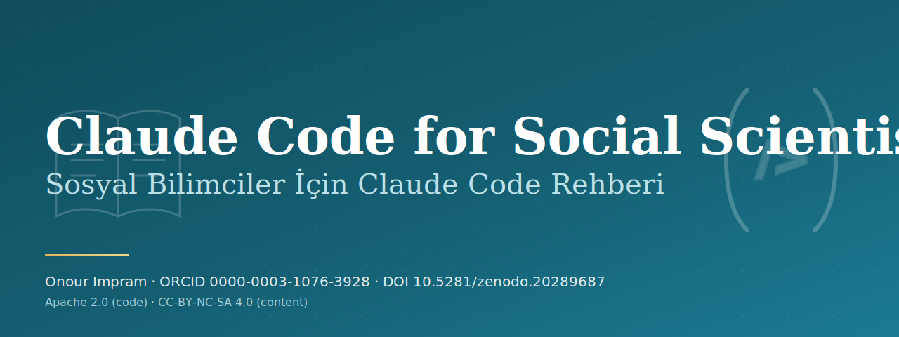

<p align="center">
  
</p>

# Sosyal Bilimciler İçin Claude Code Rehberi

Anthropic Claude Code'u araştırmada, eğitimde ve akademik yazımda kullanmak isteyen sosyal bilimciler için iki dilli, açık kaynak bir rehber. Bu araçları gerçek akademik üretim sürecinde kullanan bir klinik psikolog ve doktora adayı tarafından yazıldı. İngilizce konuşulan dünyanın dışındaki araştırmacılara, içeridekilere de seslenerek.

> **Durum.** Güncel sürüm v3.0.2. Yirmi bir kitapçık Türkçe ve İngilizce tamamlandı, insan incelemesinden geçti ve atıf denetimi yapıldı. On iki kategorinin her birinde en az bir yayımlanmış kitapçık var. Kitapçıkları yinelenebilir iş akışlarına dönüştüren yirmi tamamlayıcı Claude Code project skill de pakete dahildir. Doğrulanmış atıf toplamı 354, uydurma atıf sıfır. v3.0 serisi JOSE makalesini bu tamamlanmış yüzeye göre yeniledi ve gönderim hazırlık paketini ekledi. Skills, pip (`social-cc-plugin`) ya da Claude Code eklentisi olarak kurulur.

> **EN readers.** The English version is in [`README.md`](./README.md). Every booklet has a `tr.md` and an `en.md` side by side. A CI check enforces this pairing on every commit.

---

## Rehberin amacı

Bilgisayar bilimi dışındaki akademik çalışmada Claude Code kullanımı için kanıta dayalı, pratiğe oturmuş bir el kitabı. Hedef kitle psikoloji, sosyoloji, eğitim, halk sağlığı, iletişim, siyaset bilimi, antropoloji ve yakın disiplinlerde çalışan araştırmacılardır. Her kitapçık Türkçe ve İngilizce tam paralel sunulur.

Rehber, sosyal bilimcinin gerçekte karşılaştığı soruları on iki tematik kategoride ele alır.

1. **Temeller.** Claude Code nedir, sohbet penceresinden nasıl ayrılır, akademik üretimde nerede iş görür.
2. **Akademik erişim.** PubMed ve Semantic Scholar MCP'leri, EZproxy ve kurumsal VPN gerçekleri, ORCID, Zotero, DergiPark, ULAKBIM TR Dizin, HEAL-Link.
3. **Hafıza sistemleri.** Uzun ömürlü arşivler, sürekli bağlam, on yıllık not arşivinde gezinme, hafızayı arşive dönüştürme mühendislik kalıbı.
4. **Arşiv mimarisi.** Klasör disiplini, MOC (Map of Content) haritaları, yazılım değişikliklerinden bağımsız kalıcı Markdown alışkanlıkları.
5. **Hook'lar ve otomasyon.** Oturum yaşam döngüsü olayları, ritüel hook'ları, kişisel bilgi tabanı için hafif sürekli entegrasyon.
6. **MCP ve eklentiler.** Akademik iş akışları için Model Context Protocol sunucularını yazma, denetleme, küratörlük etme.
7. **Akademik yazım.** Türkçe ve İngilizce IMRAD iskeleti, DOI disiplini ile APA 7, dergi uyumu, makale revizyonu.
8. **Veri analizi.** Yeniden üretilebilir iş akışları, istatistiksel test seçimi, nitel kodlama, karma yöntem disiplini.
9. **Etik ve IRB.** Helsinki Bildirgesi, COPE, WAME, ICMJE, STM 2025, AB Yapay Zekâ Yasası 2024/1689 Madde 50, ENAI, KVKK ve GDPR.
10. **Hakem değerlendirmesi.** Geri dönüş mektupları, izlenebilirlik matrisi, hakem yanıt disiplini, AI iz silme yazımı.
11. **Konferans sunumu.** Slayt, poster, lightning talk, ağ kurma protokolleri.
12. **Sorun giderme.** Araç çalışmadığında, çalışmalar çeliştiğinde, hakem yanlış soru sorduğunda.

Her kitapçık kısa, iddialı ve yazarın kendi akademik pratiğinde sınanmıştır.

## İki dilli neden

Türkçe ve İngilizce tam paralel sunulur. Dünya genelinde yaklaşık doksan milyon Türkçe konuşan vardır ve Batı Avrupa'da geniş bir Türk diasporası bulunur. Oysa Türkçe akademik yapay zekâ kaynakları bu talebe kıyasla oldukça azdır. Bu boşluk rastlantı değildir. Sosyal bilimde coding agent kullanımına dair 2026 tarihli büyük ölçekli bir tarama, ABD ve Kanada'daki araştırmacıları örnekler ve benimsemenin kariyer aşaması, cinsiyet ile kurum prestiji ekseninde eğik olduğunu bulur ([Anthropic, 2026](https://www.anthropic.com/research/coding-agents-social-sciences)). Bu çerçevenin dışından, tam paralel yazılmış bir rehber, o eğikliğe karşı çalışmanın somut bir yoludur. İngilizce sürümün amacı ise uluslararası meslektaşların okuyabilmesi, İngilizce dergilerde atıf yapılabilmesi ve küresel akademik arama motorlarından ulaşılabilmesidir. Her kitapçık kendi klasöründe `tr.md` ve `en.md` olarak yan yana yaşar. Sürekli entegrasyon kontrolü, bu eşleşmeyi bozan herhangi bir commit'i reddeder.

## Bu rehber kimin için, kimin için değil

Anket çalışması yürüten yardımcı doçent için. Sistematik derleme yazan doktora öğrencisi için. R&R hazırlayan doktora sonrası araştırmacı için. Bu üç profil rehberin çekirdeğini oluşturur. Müfredat tasarlayan öğretim üyesi için. IRB sürecinde ilerleyen klinik araştırmacı için. Kodu okuyabilen ama tek bir paragraf yazmak uğruna bir haftalık araç öğrenimine vakit ayırmak istemeyen insanlar için.

Bir Claude Code başvuru kılavuzu değildir. Anthropic kendi belgelerini yayımlamaktadır. Bir yapay zekâ abartı belgesi de değildir. Yapay zekânın makalenizi sizin için yazacağına söz vermez. Öte yandan, 2026 yılında yapay zekânın akademik üretimde hiçbir rol oynamadığını da varsaymaz. Rehberin konumu, akademik yayıncılığın uzlaşı çerçevesi (COPE 2023, WAME 2023, ICMJE 2024, STM 2025) ve AB Yapay Zekâ Yasası 2024/1689 şeffaflık yükümlülükleri kapsamında dürüst ortak yazarlıktır.

## Yazarlık ve yapay zekâ ortak yazarlığı

Yazar Onour Impram: Türkiye, Yunanistan ve İrlanda lisanslı klinik psikolog, İstanbul Üniversitesi Klinik ve Sağlık Psikolojisi doktora adayı, Biruni Üniversitesi dış öğretim görevlisi, yapay zekâ ve ruh sağlığı araştırmacısı. ORCID: [0000-0003-1076-3928](https://orcid.org/0000-0003-1076-3928).

Claude Code bir taslak ve doğrulama yardımcısı olarak kullanılır. Her kitapçık, akademik yayıncılığın uzlaşı çerçevesi (COPE 2023, WAME 2023, ICMJE 2024, STM 2025) ile AB Yapay Zekâ Yasası 2024/1689 Madde 50 şeffaflık yükümlülükleri ve ENAI etik kullanım önerileri doğrultusunda katkı düzeyini belgeleyen bir frontmatter bloğu taşır. Bu blok yalnızca insanlar için değildir: yapay zekâ araçlarının da okuyabildiği, onlara işin doğru yapılmasına yön veren yapılandırılmış bir kayıttır. Blok hangi aracın, hangi rolde, hangi katkı düzeyinde kullanıldığını ve insan incelemesinin durumunu açıkça gösterir (`ai_assisted`, `ai_tools.model_alias`, `ai_tools.model_dated`, `ai_contribution_level`, `human_review`). Ne var ki bir beyan tek başına yeterli değildir. Yapay zekânın metinde nasıl ve hangi biçimlerde kullanıldığı açıkça anlatılır. Tam politika için [`AI-AUTHORSHIP.md`](./AI-AUTHORSHIP.md) dosyasına bakınız.

## Depo düzeni

```
claude-code-for-social-scientists/
├── README.md                  (İngilizce ana belge)
├── README.tr.md               (bu dosya)
├── LICENSE                    (çift lisans başlığı)
├── LICENSE.code               (Apache 2.0 tam metni)
├── LICENSE.content            (CC-BY-NC-SA 4.0 tam metni)
├── CITATION.cff               (Zenodo concept DOI: 10.5281/zenodo.20289687)
├── AI-AUTHORSHIP.md           (beyan politikası)
├── CATALOG.md                 (planlanan ve taslak haldeki tüm kitapçıkların kataloğu)
├── package.json               (yerel lint ve doğrulama komutları)
├── CODE_OF_CONDUCT.md
├── CONTRIBUTING.md            (İngilizce)
├── CONTRIBUTING.tr.md         (Türkçe)
├── .claude/
│   └── skills/                (Claude Code project skills)
├── booklets/
│   ├── 001-foundations/
│   ├── 002-academic-access/
│   ├── ... (012 kategori)
├── template/                  (kitapçık başlangıç şablonları)
├── meta/
│   ├── roadmap.md
│   ├── contributors.md
│   └── ai-disclosure.md
├── scripts/
│   ├── README.md
│   └── validate-repo.mjs
└── .github/
    └── workflows/
        ├── ci.yml             (markdownlint + repo bütünlüğü doğrulaması)
        ├── citation-check.yml (cff-validator)
        └── secret-scan.yml    (gitleaks)
```

## Kataloglama düzeni

Her kitapçığın `KKK-AA-SSSS` biçiminde sabit bir kimliği vardır.

- `KKK` üç haneli kategori kodu (001 ile 012 arası).
- `AA` kategori içi iki haneli alt kategori kodu.
- `SSSS` dört haneli sıra numarası.

Örneğin `001-01-0001`, Temeller kategorisinin birinci alt kategorisinin birinci kitapçığıdır. Tam katalog [`CATALOG.md`](./CATALOG.md) dosyasında yaşar. Yayım sonrası kimlikler değişmez: kitapçık ileride revize edilse bile kimlik sabit kalır. Revizyonlar kitapçığın kendi frontmatter ve değişiklik kaydında tutulur.

## Project Skills

Skills katmanı [`.claude/skills/`](./.claude/skills/) altında yirmi Claude Code project skill içerir ve araştırma yaşam döngüsünü literatür kapsamlamadan yayın bütünlüğüne kadar kapsar. Kitapçıklar teoriyi, pedagojiyi ve akademik çerçeveyi taşır. Skills katmanı ise tekrarlanabilir iş akışlarını, denetim listelerini ve güvenli çalışma sınırlarını taşır. Her skill, rehberin iki dillilik ilkesini skill katmanına taşıyan bir Türkçe kullanım bölümüyle kapanır.

| Skill | Tamamlayıcı kitapçıklar | Amaç |
|---|---|---|
| `social-science-literature-triage` | 002, 007 | Literatür taraması başlamadan önce veri tabanı seçimi, dil katmanı, DOI durumu ve dahil etme ölçütlerini yapılandırır. |
| `apa-doi-verifier` | 007 | APA 7 kaynakçayı temizler, DOI metadata doğrulaması yapar ve uydurma atıf riskini sınıflar. |
| `bilingual-booklet-pairing` | tüm kitapçık çiftleri | `tr.md` ve `en.md` eşliğini, frontmatter uyumunu, başlıkları ve kültürel adaptasyon notlarını denetler. |
| `ai-disclosure-auditor` | tüm kitapçık çiftleri | AI katkı alanlarını, insan incelemesini, atıf sayılarını, model metadata alanlarını ve beyan standardını denetler. |
| `ethics-irb-ai-protocol` | 009 | Etik kurul, KVKK, GDPR, EU AI Act, beyan ve veri minimizasyonu kontrol listesi üretir. |
| `rebuttal-traceability-matrix` | 010 | Hakem yorumlarını yanıt kategorilerine, manuscript değişiklik haritasına ve editör yanıt taslağına çevirir. |
| `memory-vault-architect` | 003, 004 | Araştırma arşivi klasörleri, MOC yapısı, frontmatter, kaynak pasaportu ve retrieval pattern tasarlar. |
| `regional-access-workflow` | 002 | DergiPark, ULAKBIM TR Dizin, HEAL-Link, YOK Thesis Center, VPN ve kütüphane yollarıyla yasal erişim akışı kurar. |
| `agentic-session-debugger` | 012 | Claude Code scope drift, loop trap, hidden state, context limit, PATH ve izin problemlerini teşhis eder. |
| `repo-release-integrity-check` | tüm repo | Release öncesi README, katalog, changelog, citation dosyaları, Zenodo DOI, release notes, AI beyanı ve kitapçık metadata uyumunu kontrol eder. |
| `anti-ai-trace-revision` | 010 | Yapay zekâ yazmış gibi okunan taslağı, atıfları ve sayıları dondurarak iki dilde insan sesine döndürür. |
| `bilingual-manuscript-scaffold` | 007 | El yazmasını tek iddia iskeletinden kurar, Türkçe önce taslak, İngilizce yeniden yazım, bölüm bölüm eşlik kontrolü. |
| `journal-fit-screening` | 007 | Dergi adaylarını kapsamla eşler, dizin durumunu dizinin kendi listesinden doğrular, predatör dergileri tarar. |
| `qualitative-coding-discipline` | 008 | Yorum yetkisini araştırmacıda tutar, yapay zekâyı ikinci kodlayıcı yapar, alıntı bütünlüğünü denetler. |
| `statistical-consultation-protocol` | 008 | Test seçimini karar günlüğüne bağlar, varsayımları gerçek veride sınar, APA raporlamasını kurar. |
| `research-ritual-hooks` | 005 | Oturum ritüellerini kancaya bağlar, bağlam yükleme, günlük kayıt ve commit bekçileri kurar. |
| `research-lifecycle-pipeline` | 001, tümü | Projenin aşamasını teşhis eder, doğru skill'e yönlendirir, her sınır geçişini kullanıcı onayına bağlar. |
| `mcp-research-stack-triage` | 006 | Araştırma için MCP sunucularını süzer, veri akışını sorgular, minimal izin ve bilinen cevaplı sınama kurar. |
| `source-passport-ledger` | 003 | Her kaynağı keşiften atfa kadar izler, doğrulanmamış referansa karantina kuralı uygular. |
| `conference-materials-bilingual` | 011 | Sunum ve posteri tek iddia etrafında kurar, görselleri analize bağlar, iki dilli yeniden yazımı yönetir. |

### Skills kurulumu

Skills iki yolla dağıtılır ve ikisi de aynı `.claude/skills/` kaynağından okur.

- **pip.** `pip install social-cc-plugin` çalıştırın, ardından `social-cc install` ile skills'i Claude yapılandırmanıza kopyalayın. Geçerli projenin `.claude/skills/` dizinine yazmak için `social-cc install --project`, paketteki skills'i listelemek için `social-cc list` kullanın.
- **Claude Code eklentisi.** `/plugin marketplace add TheGoatPsy/claude-code-for-social-scientists` çalıştırın, ardından `/plugin install social-cc-plugin@claude-code-for-social-scientists` ile kurun. [`.claude-plugin/marketplace.json`](./.claude-plugin/marketplace.json) marketplace manifesti ve [`.claude-plugin/plugin.json`](./.claude-plugin/plugin.json) eklenti manifesti aynı skills'i sunar.

Installer kodu Apache 2.0'dır. Kopyalanan skill içeriği CC-BY-NC-SA 4.0 altında kalır. Düz yazı için ticari olmayan kullanım ve atıf koşulları geçerlidir. Bkz. [Lisans](#lisans).

## Lisans

Kod ve yapılandırma **Apache License, Version 2.0** kapsamındadır ([`LICENSE.code`](./LICENSE.code)). Kitapçıklar, rehberler, düz yazı ve öğretici içerik **Creative Commons Attribution-NonCommercial-ShareAlike 4.0 International** kapsamındadır ([`LICENSE.content`](./LICENSE.content)). Çift lisans modelinin özeti depo kökündeki [`LICENSE`](./LICENSE) dosyasındadır. Düz yazı içeriğinin ticari kullanımı için önceden yazılı izin gerekir. İletişim prosedürü için LICENSE dosyasını okuyunuz.

## Atıf

Bu çalışmayı atıf gösterecekseniz [`CITATION.cff`](./CITATION.cff) dosyasındaki makine okunabilir kaydı veya GitHub üzerindeki "Cite this repository" düğmesini kullanınız. Zenodo concept DOI (en son sürüme çözümlenir): **10.5281/zenodo.20289687**. Kanonik kayıt için bkz. <https://doi.org/10.5281/zenodo.20289687>. Zenodo her version DOI'yi GitHub release yayımlandıktan sonra üretir. Bu nedenle immutable tag arşivleri concept DOI ve daha önce bilinen version DOI'leri içerebilir. Yeni üretilen version DOI üst verisi, Zenodo kaydı oluşunca `main` üzerinde kaydedilir.

## Köken ve koruma

Bu eserin telif hakkı kendiliğinden doğar. Bern Sözleşmesi gereği eser oluştuğu an yazarın yetki alanlarında (Türkiye, Yunanistan, İrlanda) ve 180'den fazla üye ülkede koruma başlar, tescil gerekmez. Yazarlık ve yayın tarihleri katmanlı biçimde kanıtlanır.

- Her sürüm için yazarın ORCID kimliğine bağlı, tarih damgalı ve atıf yapılabilir bir DOI üreten **Zenodo** (CERN).
- Her sürümü Bitcoin zincirine çapalayan **OpenTimestamps** (bkz. [`provenance/`](./provenance/)).
- Yazarlığı ve tarihleri yalnızca ekleme yapılan, içerik adresli bir kayıtta tutan **genel Git geçmişi**.
- Koşulları insan ve makine okunabilir biçimde belirten **Creative Commons ve Apache lisans bildirimleri**.

Genel kaynak ayrıca Software Heritage arşivinde kalıcı olarak arşivlenmeye uygundur.

## Yol haritası

Halka açık faz planı için [`meta/roadmap.md`](./meta/roadmap.md) dosyasına bakınız. Güncel sürüm v3.0.2. v3.0 serisi JOSE makalesini yirmi bir kitapçık ve yirmi skill yüzeyine göre yeniledi, gönderim hazırlık listesi [`meta/jose-submission.md`](./meta/jose-submission.md) dosyasında ve makale PDF'i derleyen bir workflow eklendi. Gönderimin kendisi yazarın onayına bağlı ayrı bir adımdır. Otuz bir kitapçıklık tam katalog, canlı laboratuvar, konferans atıfları ve eğitim materyali kullanımı uzun vadeli hedef olmayı sürdürüyor.

## Katkıda bulunma

Yapay zekânın İngilizce dışı akademik ekosistemlere nasıl indiğini önemseyen sosyal bilim araştırmacıları, klinisyenler, eğitim tasarımcıları, kütüphaneciler ve mühendislerin katkıları beklenmektedir. Pull request iş akışı, iki dilli eşleşme kuralı ve beyan beklentileri için [`CONTRIBUTING.tr.md`](./CONTRIBUTING.tr.md) dosyasını okuyunuz.

## İletişim

Onour Impram. İstanbul, Türkiye / Komotini, Yunanistan. Proje koordinasyonu için GitHub issues, discussions veya sürdürücünün GitHub profilindeki iletişim yüzeyini kullanınız.
