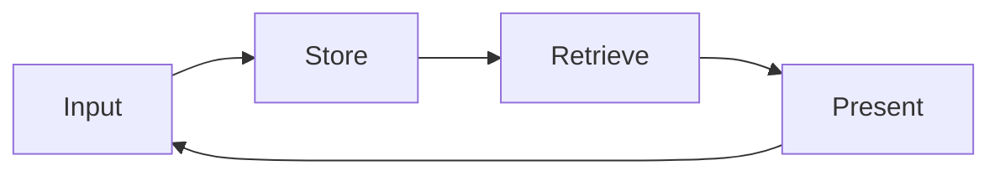

# Memory as Vault, A First-Principles Introduction

The previous category established the academic access infrastructure. This category begins with the question of where every retrieved document should go. A literature scan, an interview transcript, a clinical observation note — all must be written somewhere, but into what structure? This booklet offers the Memory as Vault pattern as its answer. That pattern is the author's original practitioner concept, presented here as the guide's working framework rather than an established construct in the cognitive science or information science literature. The aim is to establish, from first principles, how a scholar holds years of accumulated context in a single persistent system.

## 1. Why a Vault

Two social science examples make the problem tangible. A clinical psychologist who has practiced for ten years holds a decade of session notes, case formulations, supervision records, and summaries of hundreds of articles. The accumulation is the foundation of clinical judgment, yet when scattered across a hard drive, a notes application, and a stack of annotated PDFs, it is effectively inaccessible. A researcher who has conducted twelve years of fieldwork in Komotini and the surrounding villages holds field notebooks, observation journals, photographs, and interview transcripts. That accumulation is twelve years of labor, yet when unstructured, every new project starts from zero. The same field, the same villages, the same families, and the researcher still digs from scratch.

In both cases the problem is identical: context accumulates, but accumulation is not the same as access. A notebook is chronological: finding something requires remembering when it was written. A vault is structural: finding something requires only knowing where it belongs. This distinction, at the scale of a decade, is what this guide calls the Memory as Vault pattern, a design that moves an AI-assisted research environment from a daily diary to a persistent, navigable archive. The claim that this structural design yields meaningful productivity gains is the guide's own inference, grounded in the logic of the pattern and in the broader information-retrieval literature. Practitioners should treat it as a working hypothesis, one that has not been validated in a controlled study.

## 2. The Historical Chain, From Memex to Zettelkasten

Memory as Vault belongs to a seventy-year intellectual tradition in information architecture. It is a current form of a deep-rooted process in knowledge design. Knowing that tradition is what makes the pattern serious and durable.

The tradition begins with Vannevar Bush. In the essay "As We May Think," published in The Atlantic in 1945, Bush imagined a device he called the Memex: a mechanized extension of personal memory that would store all of an individual's books, records, and communications and build associative trails among them. The insight was precise: the human mind works by association, so an information system should honor those links rather than impose a single hierarchy. The formal concept came from Ted Nelson. Nelson (1965), proposing a file structure for complex, changing, and indeterminate information, defined hypertext for the first time as the idea that texts can relate to one another as a network rather than a linear sequence.

The practical demonstration came from Niklas Luhmann. Luhmann (1992) worked with a slip-box he called the Zettelkasten. Each slip carried an atomic thought, connected to others by reference numbers rather than folders. Over roughly five decades Luhmann used this system as what he called a communication partner, something closer to a thinking interlocutor than a filing cabinet, producing approximately seventy books and hundreds of articles. Sönke Ahrens (2017) translated the technique for modern knowledge workers, reformulating it through atomic notes, bidirectional links, and the note system as a thinking tool. That lineage — Bush's associative vision, Nelson's hypertext formalism, Luhmann's sustained practice, Ahrens's translation — is what the Memory as Vault pattern inherits. What none of them anticipated was that the retrieval step could be delegated to a language model working directly inside the archive.

## 3. Operational Principles

Memory as Vault, as the guide defines it, rests on a set of operational principles that each represent an engineering decision the researcher makes once and benefits from for years.

The Markdown base keeps every document in the vault in plain-text form. Plain text is tied to no proprietary software, readable with any editor, and legible thirty years from now without conversion. Frontmatter is structured metadata at the head of each document (date, type, tags, related documents) that makes the file machine-queryable without opening it. The file tree places documents in a meaningful folder hierarchy, an engineering decision and the subject of the next booklet. Links connect documents through bracketed syntax so that Nelson's hypertext idea becomes operative inside the vault. Maps of content (MOCs) serve as gateway documents for a topic, gathering pointers to related files in one place so a researcher can enter a theme rather than search for it.

All of these principles are substitutable. Another plain-text format instead of Markdown, a different metadata schema, a different folder logic: any of these can replace the specific choices above. What stays fixed underneath all of them is simpler than it looks: capture information, locate it again, connect it to other things, move through it. That logic is the subject of the next section.

## 4. The Memory as Vault Engineering Pattern

The core logic of Memory as Vault, as the guide conceives it, is a cycle: Input, Store, Retrieve, Present. This cycle is the invariant skeleton of the pattern. The operational principles described in the previous section are one concrete instantiation of that skeleton. The skeleton itself is independent of both tool and platform.

Input is where information enters the vault. An article record, a field note, a clinical observation — anything the researcher captures gets converted to plain text at this step. Store assigns it a location: the right folder, the right frontmatter fields, the right links. This step determines future accessibility entirely, because information stored in the wrong place cannot be found. At Retrieve the value of the vault becomes visible: text search, frontmatter query, link traversal. Present completes the cycle by putting retrieved material to work in a new context — a literature synthesis, an argument draft, a case formulation.

The feature that distinguishes this pattern from a conventional database cycle is the feedback arrow from Present back to Input. A database receives, stores, queries, and returns data, but the data it returns does not change the system itself. In the Memory as Vault design, as this guide conceives it, every Present step reshapes the vault: the synthesis enters as a new atomic note, that note forms new links with earlier notes, and the relevant maps of content are updated. Over time the vault becomes a record of the researcher's evolving way of thinking, an instrument that grows more refined with use. For the social scientist, a vault well maintained for ten years accumulates depth that no new tool can replicate.

## 5. Integration with Claude Code

The practical power of the Memory as Vault pattern in an AI-assisted workflow comes from the language model's ability to work directly with vault contents. Claude Code, granted file-read permission over the vault directory, can ground its answers in the actual documents a researcher has accumulated. When the model answers a question, it reads the relevant files and synthesizes their content, so the output reflects the researcher's own intellectual accumulation rather than generic training-data patterns.

The technical mechanism underlying this is retrieval-augmented generation (RAG). Lewis et al. (2020) defined retrieval-augmented generation for knowledge-intensive natural language processing tasks: before producing an answer, the model retrieves relevant passages from an external knowledge base and grounds its response in those passages. The guide's inference, going beyond what Lewis et al. establish, is that a well-structured Markdown vault is a viable knowledge base for this mechanism when operated through Claude Code's file-read access. That application is the guide's own and has not been validated in a controlled study. Practitioners should treat it as a reasoned engineering proposal.

There is an important limit to hold clearly. The vault's role is retrieval, not planning. Valmeekam et al. (2023), investigating the planning abilities of large language models critically, demonstrated that these models have marked limitations in complex multi-step planning. Even the best model in their study remained at low success rates on standard planning benchmarks. This finding is why the vault should remain in the retrieval role: it supplies reliable information, but planning and research judgment remain with the researcher. Khattab et al. (2023), with the DSPy framework for compiling declarative language model calls into self-improving pipelines, showed one way the retrieval and generation components can be formally structured. That framework is one example of how the retrieval component of a vault-based workflow could be technically reinforced. Practitioners who want to go further will find DSPy a useful starting point. How far to go depends on the research context.

## 6. Retrieval Patterns

Retrieving information from a vault follows patterns of increasing semantic depth. The most basic is text search: a term or phrase queried across all documents, performed with the classic `grep` tool. Fast and exact. The second is file-pattern matching (glob), which gathers files by name or path structure: all daily logs for a given year, all files in a particular project subfolder.

The third pattern is the frontmatter query: the structured metadata of documents is queried directly, for example all files tagged with a particular topic and created after a particular date. This is where the structural power of the vault becomes visible. Rather than digging chronologically, the researcher makes a structural selection. The fourth and most semantically rich pattern is semantic search, performed via a tool connected through MCP. Semantic search does not match exact terms but finds documents that are close in meaning, so a search for "anxiety" also surfaces files containing "worry," "fear," or "apprehension." Together these patterns form a spectrum from exact keyword to deep semantic matching, and the researcher selects whichever is most appropriate for the query at hand. In practice, most retrieval workflows begin with frontmatter queries to narrow the candidate set and end with targeted text search within that set.

## 7. Risks

Memory as Vault is a genuinely useful pattern, but it carries real risks that practitioners should name explicitly.

Conceptual fatigue is real. Continuously organizing, tagging, and linking a vault requires sustained labor. When that labor exceeds the retrieval value the vault returns, maintenance becomes a drain. The mitigation is structural simplicity: the operational principles applied with minimum friction, a vault that is navigable rather than exhaustively ordered.

Tool dependence is a quieter hazard. If a researcher ties their vault to a single application, one proprietary note tool or one vendor's ecosystem, the vault is at risk whenever that application changes its format, raises its price, or shuts down. The plain-text Markdown principle is the mitigation: as long as the vault is plain text, it is readable with any editor and portable to any platform.

Clinical data carries the heaviest obligation. A clinical psychologist's vault must not contain non-anonymized patient data. This is both an ethical obligation and a legal one. Clinical data may enter the vault only after de-identification and within the framework of ethics-board approval. This risk connects directly to the regional legal environment described in the next section.

## 8. Türkiye and Greece Specificity

When clinical and human-subject data are at stake, Türkiye and Greece present two distinct but structurally convergent legal frameworks. In Türkiye, Law No. 6698 on the Protection of Personal Data designates clinical data as special-category personal data. The Personal Data Protection Authority (2024), in its guide on the protection of personal health data, emphasizes the quality of explicit consent and the principle of data minimization as the governing standards. The practical consequence is clear: a clinical psychologist or hospital researcher in Türkiye does not hold non-anonymized clinical data in their vault. They should not.

Greece, as a European Union member state, falls under the General Data Protection Regulation directly. The European Data Protection Board (2024), in its guidelines on the protection of personal data in research, defines the limits of data processing in the research context. The structural similarity between the Turkish framework and the GDPR is high: both center on data minimization and purpose limitation as core principles. The practice of the ethics board at Democritus University in Komotini is one concrete application of this framework. A field researcher bringing interview transcripts into the vault replaces participant identities with codes before any file enters the system, keeping the vault both research-functional and legally compliant.

## 9. Bridge, to Vault Architecture

Of the four steps of the Memory as Vault cycle, the Store step is the subject of the next booklet. The question of where information belongs appears simple. It is not. A wrong folder architecture compounds silently over years into a hidden productivity cost: searches slow, results fill with noise, and each new project rebuilds orientation that should already exist. A right architecture moves file-finding from recollection to navigation. The next booklet treats folder discipline and the maps of content pattern as engineering decisions with long-term consequences.

## References

Citations are in APA 7 format. DOIs and arXiv identifiers were independently verified on 2026-06-04. Bush (1945) and Luhmann (1992) predate DOI registration. Ahrens (2017) is a trade book. The Personal Data Protection Authority (2024) and European Data Protection Board (2024) are institutional grey-literature sources cited for their regulatory authority. Neither carries a DOI.

Ahrens, S. (2017). *How to take smart notes: One simple technique to boost writing, learning and thinking*. ISBN 978-1542866507

Bush, V. (1945, July). As we may think. *The Atlantic Monthly*, 176(1), 101–108.

European Data Protection Board. (2024). *Guidelines on the protection of personal data in research*. https://edpb.europa.eu

Khattab, O., Singhvi, A., Maheshwari, P., Zhang, Z., Santhanam, K., Vardhamanan, S., Haq, S., Sharma, A., Joshi, T. T., Moazam, H., Miller, H., Zaharia, M., & Potts, C. (2023). DSPy: Compiling declarative language model calls into self-improving pipelines. *arXiv*. https://arxiv.org/abs/2310.03714

Lewis, P., Perez, E., Piktus, A., Petroni, F., Karpukhin, V., Goyal, N., Küttler, H., Lewis, M., Yih, W., Rocktäschel, T., Riedel, S., & Kiela, D. (2020). Retrieval-augmented generation for knowledge-intensive NLP tasks. *Advances in Neural Information Processing Systems*, 33, 9459–9474. https://arxiv.org/abs/2005.11401

Luhmann, N. (1992). Kommunikation mit Zettelkästen. In *Universität als Milieu: Kleine Schriften* (pp. 53–61). Haux.

Nelson, T. H. (1965). Complex information processing: A file structure for the complex, the changing and the indeterminate. *Proceedings of the 1965 20th National Conference*, 84–100. https://doi.org/10.1145/800197.806036

Personal Data Protection Authority. (2024). *Guide on the protection of personal health data*. https://www.kvkk.gov.tr

Valmeekam, K., Marquez, M., Sreedharan, S., & Kambhampati, S. (2023). On the planning abilities of large language models: A critical investigation. *Advances in Neural Information Processing Systems*, 36, 75993–76005. https://doi.org/10.52202/075280-3320

---

**Booklet ID.** `003-01-0001`
**Version.** `0.1.0`
**Date.** 2026-06-20
**Approximate word count.** 2184 (English body text, measured with wc)
**Verified citations.** 9
**Hallucinated citations.** 0
**Original concept.** Memory as Vault is the author's original practitioner concept, presented here as the guide's working framework.
**Previous booklet.** [`002-04-0001`](../../002-academic-access/002-04-0001/en.md). DergiPark, ULAKBIM TR Dizin, HEAL-Link, and Regional Indexing
**Next booklet.** [`004-01-0001`](../../004-vault-architecture/004-01-0001/en.md). Folder Discipline and the Maps of Content (MOC) Pattern
