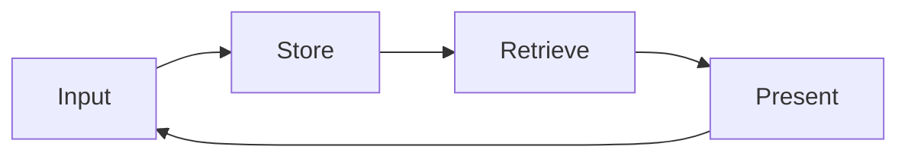

# Memory as Vault, A First-Principles Introduction

The previous category established the academic access infrastructure. This category begins with the question of where every retrieved document should go — a literature scan, an interview transcript, a clinical observation note. All of these must be written somewhere, but into what structure? This booklet offers the Memory as Vault pattern as its answer. That pattern is the author's original practitioner concept, not an established construct in the cognitive science or information science literature; it is presented here as the guide's working framework. The aim is to establish, from first principles, how a scholar holds years of accumulated context in a single persistent system.

## 1. Why a Vault

Two social science examples make the problem tangible. A clinical psychologist who has practiced for ten years holds a decade of session notes, case formulations, supervision records, and summaries of the hundreds of articles they have read. The accumulation is the foundation of clinical judgment — but when scattered across a hard drive, a notes application, and a stack of annotated PDFs, it is effectively inaccessible. A researcher who has conducted twelve years of fieldwork in Komotini and the surrounding villages holds field notebooks, observation journals, photographs, and interview transcripts. That accumulation is twelve years of labor — but when unstructured, every new project starts from zero. The same field, the same villages, the same families — and still, the researcher digs from scratch.

In both cases the problem is identical: context accumulates, but accumulation is not the same as access. A notebook is chronological; finding something requires remembering when it was written. A vault, by contrast, is structural; finding something requires only knowing where it belongs. This distinction, at the scale of a decade, is what this guide calls the Memory as Vault pattern — a design that moves an AI-assisted research environment from a daily diary to a persistent, navigable archive. The claim that this structural design yields meaningful productivity gains is the guide's own inference, grounded in the logic of the pattern and in the broader information-retrieval literature; it should be treated as a practitioner hypothesis rather than an experimentally established finding.

## 2. The Historical Chain, From Memex to Zettelkasten

Memory as Vault is not a new consumer trend but part of a seventy-year intellectual tradition in information architecture. Knowing that tradition is what makes the pattern serious and durable.

The first link is Vannevar Bush. In the essay "As We May Think," published in The Atlantic in 1945, Bush imagined a device he called the Memex: a mechanized extension of personal memory that would store all of an individual's books, records, and communications and build associative trails among them. The insight was precise — the human mind works by association, so an information system should honor associative links, not impose a single hierarchy. The second link is Ted Nelson. Nelson (1965), proposing a file structure for complex, changing, and indeterminate information, defined hypertext for the first time: the idea that texts can relate to one another not linearly but as a network.

The third link is Niklas Luhmann. Luhmann (1992) worked with a slip-box system he called the Zettelkasten. Each slip carried an atomic thought; slips were connected by reference numbers rather than folders. Over more than fifty years of sustained output — approximately seventy books and hundreds of articles — Luhmann used this system as what he described as a communication partner rather than merely a storage medium. The modern retrieval of the Zettelkasten for knowledge workers was carried out by Sönke Ahrens (2017), who reformulated the technique through the concepts of atomic notes, bidirectional links, and the note system as a thinking tool rather than a filing cabinet. The chain from Bush to Ahrens constitutes the intellectual lineage of the Memory as Vault pattern. This guide's contribution is to extend that lineage into the age of AI-assisted research.

## 3. Five Principles

Memory as Vault, as the guide defines it, rests on five operational principles. Each represents an engineering decision that the researcher makes once and benefits from for years.

The first principle is the Markdown base. Every document in the vault lives in plain-text Markdown. Plain text is tied to no proprietary software, readable with any editor, and legible thirty years from now without conversion. The second principle is frontmatter: structured metadata at the head of each document — date, type, tags, related documents — that makes the file machine-queryable without opening it. The third principle is the file tree: a meaningful folder hierarchy that is not arbitrary decoration but an engineering decision, the subject of the next booklet. The fourth principle is links: documents reference one another through bracketed syntax, so that Nelson's hypertext idea becomes operative inside the vault. The fifth principle is maps of content — MOCs. A map of content is a gateway document for a topic, gathering pointers to related files in one place so a researcher can enter a theme rather than search for it.

The important point about these five principles is that all of them are substitutable. Another plain-text format instead of Markdown, a different metadata schema, a different folder logic — any of these can replace the specific choices above. What is invariant is not the principles themselves but the logic beneath them: capture, locate, link, navigate. That logic is the subject of the next section.

## 4. The Memory as Vault Engineering Pattern

The core logic of Memory as Vault, as the guide conceives it, is a four-step cycle: Input, Store, Retrieve, Present. These four steps are the invariant skeleton. The five principles are one concrete instantiation of that skeleton; the skeleton itself is independent of both tool and platform.

Input is where information enters the vault: an article record, a field note, a clinical observation. At this step the information is captured and converted to plain text. Store is where it is assigned a location: the right folder, the right frontmatter fields, the right links. This step determines future accessibility entirely — information stored in the wrong place cannot be found. Retrieve is where information is recalled: a text search, a frontmatter query, a link traversal. This step is where the value of the vault becomes visible. Present is where retrieved information is used in a new context: a literature synthesis, an argument draft, a case formulation.

The feature that distinguishes this pattern from a conventional database cycle is the feedback arrow from Present back to Input. A database receives, stores, queries, and returns data — but the data it returns does not change the system itself. In the Memory as Vault design, as this guide conceives it, every Present step reshapes the vault: the synthesis enters as a new atomic note, that note forms new links with earlier notes, and the relevant maps of content are updated. Over time the vault becomes a record of the researcher's evolving way of thinking — not merely a larger storage space but a more refined instrument. For the social scientist, the consequence, in the guide's estimation, is that a vault well maintained for ten years does not merely grow; it matures.

## 5. Integration with Claude Code

The practical power of the Memory as Vault pattern in an AI-assisted workflow comes from the language model's ability to work directly with vault contents. Claude Code, granted file-read permission over the vault directory, can ground its answers in the actual documents a researcher has accumulated rather than in generic training-data knowledge. When the model answers a question, it reads the relevant files and synthesizes their content — so the output reflects the researcher's own intellectual accumulation, not a statistical average of the web.

The technical mechanism underlying this is retrieval-augmented generation (RAG). Lewis et al. (2020) defined retrieval-augmented generation for knowledge-intensive natural language processing tasks: before producing an answer, the model retrieves relevant passages from an external knowledge base and grounds its response in those passages. The guide's inference — going beyond what Lewis et al. establish — is that a well-structured Markdown vault is a viable knowledge base for this mechanism when operated through Claude Code's file-read access. That application is the guide's own and has not been validated in a controlled study; practitioners should treat it as a reasoned engineering proposal.

There is an important limit to hold clearly. The vault's role is retrieval, not planning. Valmeekam et al. (2023), investigating the planning abilities of large language models critically, demonstrated that these models have marked limitations in complex multi-step planning — the best model in their study achieved roughly 12% success on standard planning benchmarks. This finding is why the vault should remain in the retrieval role: it supplies reliable information, but planning and research judgment remain with the researcher. Khattab et al. (2023), with the DSPy framework for compiling declarative language model calls into self-improving pipelines, showed one way the retrieval and generation components can be formally structured. That framework is one example of how the retrieval component of a vault-based workflow could be technically reinforced; it is offered here as a pointer to the technical literature, not as a prescription.

## 6. Retrieval Patterns

There are several patterns for retrieving information from a vault, arranged in an order of increasing semantic depth. The most basic is text search: a term or phrase queried across all documents, performed with the classic `grep` tool. Fast and exact. The second is file-pattern matching — glob — which gathers files by name or path structure: all daily logs for a given year, all files in a particular project subfolder.

The third pattern is the frontmatter query: the structured metadata of documents is queried directly — for example, all files tagged with a particular topic and created after a particular date. This is where the structural power of the vault becomes visible. Rather than digging chronologically, the researcher makes a structural selection. The fourth and most semantically rich pattern is semantic search, performed via a tool connected through MCP. Semantic search does not match exact terms but finds documents that are close in meaning — so a search for "anxiety" also surfaces files containing "worry," "fear," or "apprehension." These four patterns form a spectrum from exact keyword to deep semantic matching, and the researcher selects the most appropriate pattern for each query type. In practice, most retrieval workflows begin with frontmatter queries to narrow the candidate set and end with targeted text search within that set.

## 7. Risks

Memory as Vault is a powerful pattern, but it carries real risks that practitioners should name explicitly.

The first is conceptual fatigue. Continuously organizing, tagging, and linking a vault requires sustained labor. If that labor exceeds the retrieval value the vault returns, the vault becomes a burden rather than an instrument. The mitigation is structural simplicity: the five principles applied with minimum friction, a vault that is sufficiently accessible rather than perfectly organized. Perfect organization is not the goal; functional navigation is.

The second risk is tool dependence. If a researcher ties their vault to a single application — one proprietary note tool, one vendor's ecosystem — the vault is at risk whenever that application changes its format, raises its price, or shuts down. The plain-text Markdown principle is the mitigation: as long as the vault is plain text, it is readable with any editor and portable to any platform.

The third and most serious risk is clinical data. A clinical psychologist's vault must not contain non-anonymized patient data. This is both an ethical obligation and a legal one. Clinical data may enter the vault only after de-identification and within the framework of ethics-board approval. This risk connects directly to the regional legal environment described in the next section.

## 8. Turkey and Greece Specificity

When clinical and human-subject data are at stake, Turkey and Greece present two distinct but structurally convergent legal frameworks. In Turkey, Law No. 6698 on the Protection of Personal Data designates clinical data as special-category personal data. The Personal Data Protection Authority (2024), in its guide on the protection of personal health data, emphasizes the quality of explicit consent and the principle of data minimization as the governing standards. The practical consequence is clear: a clinical psychologist or hospital researcher in Turkey does not hold non-anonymized clinical data in their vault — and should not.

Greece, as a European Union member state, falls under the General Data Protection Regulation directly. The European Data Protection Board (2024), in its guidelines on the protection of personal data in research, defines the limits of data processing in the research context. The structural similarity between the Turkish framework and the GDPR is high: both center on data minimization and purpose limitation as core principles. The practice of the ethics board at Democritus University in Komotini is one concrete application of this framework. A field researcher bringing interview transcripts into the vault replaces participant identities with codes before any file enters the system — keeping the vault both research-functional and legally compliant.

## 9. Bridge, to Vault Architecture

Of the four steps of the Memory as Vault cycle, the Store step is the subject of the next booklet. The question of where information belongs appears simple. It is not. A wrong folder architecture compounds silently over years into a hidden productivity cost — every file retrieval takes a moment longer, every search returns more noise, every new project requires reconstructing what should already be navigable. A right architecture moves file-finding from recollection to navigation. The next booklet treats folder discipline and the maps of content pattern not as personal preference but as engineering decisions with long-term consequences.

## References

Citations are in APA 7 format. DOIs and arXiv identifiers were independently verified on 2026-06-04. Bush (1945) and Luhmann (1992) predate DOI registration; Ahrens (2017) is a trade book. The Personal Data Protection Authority (2024) and European Data Protection Board (2024) are institutional grey-literature sources cited for their regulatory authority; neither carries a DOI.

Ahrens, S. (2017). *How to take smart notes: One simple technique to boost writing, learning and thinking*. ISBN 978-1542866507

Bush, V. (1945, July). As we may think. *The Atlantic Monthly*, 176(1), 101–108.

European Data Protection Board. (2024). *Guidelines on the protection of personal data in research*. https://edpb.europa.eu

Khattab, O., Singhvi, A., Maheshwari, P., Zhang, Z., Santhanam, K., Vardhamanan, S., Haq, S., Sharma, A., Joshi, T. T., Moazam, H., Miller, H., Zaharia, M., & Potts, C. (2023). DSPy: Compiling declarative language model calls into self-improving pipelines. *arXiv*. https://arxiv.org/abs/2310.03714

Lewis, P., Perez, E., Piktus, A., Petroni, F., Karpukhin, V., Goyal, N., Küttler, H., Lewis, M., Yih, W., Rocktäschel, T., Riedel, S., & Kiela, D. (2020). Retrieval-augmented generation for knowledge-intensive NLP tasks. *Advances in Neural Information Processing Systems*, 33, 9459–9474. https://arxiv.org/abs/2005.11401

Luhmann, N. (1992). Kommunikation mit Zettelkästen. In *Universität als Milieu: Kleine Schriften* (pp. 53–61). Haux.

Nelson, T. H. (1965). Complex information processing: A file structure for the complex, the changing and the indeterminate. *Proceedings of the 1965 20th National Conference*, 84–100. https://doi.org/10.1145/800197.806036

Personal Data Protection Authority. (2024). *Guide on the protection of personal health data*. https://www.kvkk.gov.tr

Valmeekam, K., Marquez, M., Sreedharan, S., & Kambhampati, S. (2023). On the planning abilities of large language models: A critical investigation. *Advances in Neural Information Processing Systems (NeurIPS 2023)*. https://arxiv.org/abs/2305.15771

---

**Booklet ID.** `003-01-0001`
**Version.** `0.1.0`
**Date.** 2026-06-04
**Approximate word count.** 2562 (English body text, measured with wc)
**Verified citations.** 9
**Hallucinated citations.** 0
**Original concept.** Memory as Vault is the author's original practitioner concept, presented here as the guide's working framework.
**Previous booklet.** [`002-04-0001`](../../002-academic-access/002-04-0001/en.md). DergiPark, ULAKBIM TR Dizin, HEAL-Link, and Regional Indexing
**Next booklet.** [`004-01-0001`](../../004-vault-architecture/004-01-0001/en.md). Folder Discipline and the Maps of Content (MOC) Pattern
