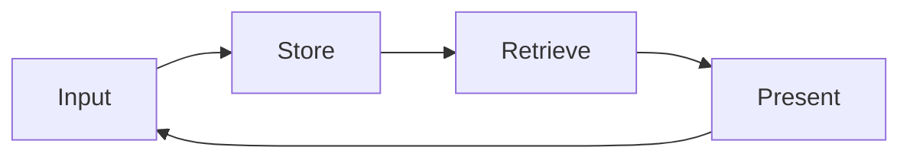

# Kasa Olarak Hafıza, İlkesel Bir Giriş

Önceki kategori, akademik erişim altyapısını kurmuştu. Bu kategori ise erişilen her belgenin nereye gideceği sorusuyla başlar. Bir literatür taraması, bir mülakat transkripti, bir klinik gözlem notu. Bunların hepsi bir yere yazılmalıdır, ama hangi yapıya? Bu broşür, bu sorunun yanıtı olarak Kasa Olarak Hafıza kalıbını sunar. Bu kalıp, yazarın özgün bir uygulayıcı kavramıdır. Bilişsel bilim ya da bilgi bilimi literatüründe yerleşik bir yapı değildir. Burada rehberin çalışma çerçevesi olarak sunulmaktadır. Amaç, bir akademisyenin yıllarca biriken bağlamını tek bir kalıcı sistemde nasıl tutacağını ilkesel temelinden kurmaktır.

## 1. Niçin Bir Kasa

İki sosyal bilim örneği, sorunu somutlaştırır. On yıldır pratik yapan bir klinik psikoloğu düşünün. Elinde on yıllık seans notları, vaka formülasyonları, süpervizyon kayıtları ve okuduğu yüzlerce makalenin özetleri vardır. Bu birikim, klinik bilgeliğin temelidir. Ne var ki bir sabit sürücüye, bir not uygulamasına ve dipnot düşülmüş bir PDF yığınına dağıldığında fiilen erişilemez hale gelir. Komotini ve çevresindeki köylerde on iki yıllık bir saha çalışması yürüten bir araştırmacıyı düşünün. Elinde alan defterleri, gözlem günlükleri, fotoğraflar ve mülakat dökümleri vardır. Bu birikim, on iki yıllık emeğin kendisidir. Yapısız kaldığında ise her yeni proje sıfırdan başlamak zorunda kalır. Aynı saha, aynı köyler, aynı aileler. Araştırmacı yine de en baştan kazar.

Her iki örnekte de sorun aynıdır: bağlam birikiyor, ama birikmek erişmekle aynı şey değildir. Bir not defteri kronolojiktir. Bir şeyi bulmak için onu ne zaman yazdığınızı hatırlamanız gerekir. Bir kasa ise yapısaldır. Bir şeyi bulmak için yalnızca nereye ait olduğunu bilmeniz yeter. Bu ayrım, on yıl ölçeğinde, yapay zekâ destekli bir çalışma ortamını günlük bir not defterinden kalıcı ve gezilebilir bir arşive taşıyan tasarımdır. Rehberin adını koyduğu bu tasarım, Kasa Olarak Hafıza kalıbıdır. Bu yapısal tasarımın anlamlı verimlilik kazanımları sağladığı iddiası, kalıbın mantığından ve bilgi erişimi literatüründen beslenen rehberin kendi çıkarsamasıdır. Bu çıkarsama, deneysel olarak doğrulanmış bir bulgu değil, bir uygulayıcı hipotezi olarak ele alınmalıdır.

## 2. Tarihsel Zincir, Memex'ten Zettelkasten'a

Kasa Olarak Hafıza yeni bir tüketim trendi değil, yetmiş yıllık bir entelektüel geleneğin parçasıdır. Bu geleneği bilmek, kalıbın ciddiyetini ve dayanıklılığını kavramak için zorunludur.

Zincirin ilk halkası Vannevar Bush'tur. Bush (1945), The Atlantic'te yayımlanan "As We May Think" başlıklı denemesinde Memex adını verdiği bir aygıt tasavvur etti. Memex, bir bireyin tüm kitaplarını, kayıtlarını ve yazışmalarını saklayan ve bunlar arasında çağrışımsal izler kuran, kişisel hafızanın mekanize bir uzantısıydı. Bush'un öngörüsü kesindi: insan zihni çağrışımla çalışır, dolayısıyla bilgi sisteminin de çağrışımsal bağlantılara saygı göstermesi, tek bir hiyerarşi dayatmaması gerekir. İkinci halka Ted Nelson'dur. Nelson (1965), karmaşık, değişen ve belirsiz bilgi için bir dosya yapısı önerdiği makalesinde hipertekst kavramını ilk kez tanımladı. Nelson'un katkısı, metinlerin doğrusal değil ağsal olarak birbirine bağlanabileceği fikriydi.

Üçüncü halka Niklas Luhmann'dır. Luhmann (1992), Zettelkasten adını verdiği fiş kutusu sistemiyle çalıştı. Her fişin atomik bir düşünce taşıdığı, fişlerin birbirine referans numaralarıyla bağlandığı bu sistemle Luhmann, elli yılı aşkın sürdürümlü bir verimlilikle yaklaşık yetmiş kitap ve yüzlerce makale üretti. Luhmann, bu sistemi yalnızca bir depolama ortamı değil, bir iletişim ortağı olarak tanımladı. Zettelkasten'in çağdaş bilgi çalışanları için modern yorumunu Sönke Ahrens (2017) yaptı. Ahrens, tekniği atomik notlar, çift yönlü bağlantılar ve bir dolap yerine bir düşünme aracı olarak not sistemi kavramları üzerinden yeniden formüle etti. Bush'tan Ahrens'e uzanan bu zincir, Kasa Olarak Hafıza kalıbının entelektüel soyağacını oluşturur. Rehberin katkısı, bu soyağacını yapay zekâ destekli araştırma çağına taşımaktır.

## 3. Beş İlke

Kasa Olarak Hafıza, rehberin tanımladığı biçimiyle, beş işlevsel ilke üzerine kurulur. Bu ilkelerin her biri, araştırmacının bir kez verdiği ve yıllarca kazandığı bir mühendislik kararını temsil eder.

Birinci ilke Markdown temelidir: kasanın her belgesi düz metin Markdown biçiminde tutulur. Düz metin hiçbir tescilli yazılıma bağlı değildir, herhangi bir editörle açılabilir ve dönüştürme gerektirmeden otuz yıl sonra da okunabilir. İkinci ilke frontmatter'dır: her belgenin başında yer alan yapılandırılmış üst veri, tarih, tür, etiketler ve ilişkili belgeler gibi bilgileri taşır ve dosyayı açmadan makine tarafından sorgulanabilir kılar. Üçüncü ilke dosya ağacıdır: belgeler anlamlı bir klasör hiyerarşisinde tutulur. Bu hiyerarşi rastgele bir düzenleme değil, bir mühendislik kararıdır ve bir sonraki broşürün konusunu oluşturur. Dördüncü ilke bağlantılardır: belgeler birbirine köşeli parantez sözdizimi aracılığıyla referans vererek Nelson'un hipertekst fikrini kasa içinde işler hale getirir. Beşinci ilke içerik haritaları, yani MOC'tur. Bir içerik haritası, belirli bir konunun giriş kapısı işlevi gören belge türüdür ve ilgili dosyalara işaretçiler sunarak araştırmacının arama yapmak zorunda kalmadan bir temaya girmesini sağlar.

Bu beş ilke hakkında önemli bir nokta var: hepsi değiştirilebilir. Markdown yerine başka bir düz metin biçimi, farklı bir üst veri şeması, farklı bir klasör mantığı, bunların herhangi biri yukarıdaki somut seçimlerin yerine geçebilir. Değişmez olan, ilkelerin kendisi değil, onların altındaki mantıktır: yakala, bul, bağla, gezin. Bu mantık, bir sonraki bölümün konusudur.

## 4. Memory-as-Vault Mühendislik Kalıbı

Kasa Olarak Hafızanın çekirdek mantığı, rehberin kurguladığı biçimiyle, dört adımlı bir döngüdür: Input, Store, Retrieve, Present. Bu dört adım, kalıbın değişmez iskeletidir. Beş ilke bu iskeletin somut bir uygulamasıdır. İskeletin kendisi ise hem araçtan hem platformdan bağımsız kalır.

Input, bilginin kasaya girdiği adımdır. Bir makale künyesi, bir alan notu, bir klinik gözlem. Bu adımda bilgi yakalanır ve düz metne dönüştürülür. Store, bilginin bir konuma atandığı adımdır: doğru klasör, doğru frontmatter alanları, doğru bağlantılar. Gelecekteki erişilebilirliği bütünüyle bu adım belirler. Yanlış yerde saklanan bilgi bulunamaz. Retrieve, bilginin geri çağrıldığı adımdır: bir metin araması, bir frontmatter sorgusu, bir bağlantı takibi. Kasanın değerinin fiilen görünür hale geldiği adım budur. Present ise geri çağrılan bilginin yeni bir bağlamda kullanıldığı adımdır: bir literatür sentezi, bir argüman taslağı, bir vaka formülasyonu.

Bu kalıbı sıradan bir veri tabanı döngüsünden ayıran özellik, Present'tan Input'a uzanan geri besleme okudur. Bir veri tabanı veri alır, saklar, sorgular ve döndürür. Döndürdüğü veri sistemin kendisini değiştirmez. Kasa Olarak Hafıza tasarımında ise rehberin kurguladığı biçimiyle, her Present adımı kasayı yeniden şekillendirir: sentez kasaya yeni bir atomik not olarak girer, o not daha önceki notlarla yeni bağlantılar kurar ve ilgili içerik haritaları güncellenir. Böylece kasa zamanla araştırmacının gelişen düşünme biçiminin kaydına dönüşür. Yalnızca büyüyen bir depolama alanı değil, giderek incelenen bir enstrüman olur. Sosyal bilimci için bu farkın sonucu açıktır: on yıl boyunca özenle tutulan bir kasa yalnızca büyümez, olgunlaşır.

## 5. Claude Code ile Entegrasyon

Kasa Olarak Hafıza kalıbının yapay zekâ destekli bir iş akışındaki pratik gücü, dil modelinin kasa içerikleriyle doğrudan çalışabilmesinden kaynaklanır. Claude Code, kasa dizini üzerinde dosya okuma yetkisiyle, yanıtlarını genel eğitim verisi bilgisine değil araştırmacının biriktirdiği gerçek belgelere dayandırabilir. Model bir soruya yanıt verirken ilgili dosyaları okur, içeriklerini sentezler. Ortaya çıkan çıktı böylece web istatistiklerinin bir ortalaması değil, kullanıcının kendi entelektüel birikiminin bir sentezi olur.

Bu mekanizmanın teknik temeli, geri çağırma destekli üretimdir. Lewis ve diğerleri (2020), bilgi yoğun doğal dil işleme görevleri için geri çağırma destekli üretim yöntemini tanımladı. Bu yöntemde model yanıt üretmeden önce harici bir bilgi tabanından ilgili parçaları çeker ve yanıtını o parçalara dayandırır. Rehberin çıkarsaması şudur ve bu çıkarsama Lewis ve diğerlerinin (2020) kurduğunun ötesine geçer: iyi yapılandırılmış bir Markdown kasası, Claude Code'un dosya okuma erişimi üzerinden çalıştırıldığında bu mekanizma için geçerli bir bilgi tabanına dönüşebilir. Bu uygulama rehberin kendi önerisidir ve kontrollü bir çalışmada doğrulanmamıştır. Uygulayıcılar bunu gerekçeli bir mühendislik önerisi olarak ele almalıdır.

Burada açıkça tutulması gereken önemli bir sınır vardır. Kasanın rolü geri çağırmadır, planlama değil. Valmeekam ve diğerleri (2023), büyük dil modellerinin planlama yeteneklerini eleştirel biçimde inceleyerek bu modellerin karmaşık çok adımlı planlamada belirgin sınırlar taşıdığını ortaya koydu. Çalışmalarındaki en iyi model, standart planlama kıyaslama testlerinde yüzde on iki civarında bir başarı oranı elde etti. Bu bulgu, kasanın niçin geri çağırma rolünde kalması gerektiğini açıklar: kasa güvenilir bir bilgi kaynağı sunar, planlama ve araştırma yargısı ise araştırmacıda kalır. Khattab ve diğerleri (2023), bildirimsel dil modeli çağrılarını kendini iyileştiren işlem hatlarına derleyen DSPy çerçevesiyle geri çağırma ve üretim bileşenlerinin biçimsel olarak nasıl yapılandırılabileceğini gösterdi. Bu çerçeve, kasa tabanlı bir iş akışının geri çağırma bileşeninin teknik olarak nasıl sağlamlaştırılabileceğine işaret eden bir örnek olarak sunulmaktadır. Bir reçete değil, teknik literatüre bir köprüdür.

## 6. Geri Çağırma Kalıpları

Bir kasadan bilgi geri çağırmanın birkaç kalıbı vardır ve bunlar giderek artan bir anlam derinliği sırasında dizilir. En temel kalıp metin aramasıdır: tüm belgeler genelinde bir terim ya da ifade sorgulanır, klasik grep aracıyla gerçekleştirilir. Hızlı ve kesin sonuç verir. Bir adım ötede dosya örüntüsü eşlemesi, yani glob yer alır: dosyalar ad ya da konum yapısına göre toplanır. Örneğin belirli bir yıla ait tüm günlük kayıtları ya da belirli bir proje alt klasörüne ait tüm dosyalar bu yolla elde edilir.

Üçüncü kalıp frontmatter sorgusudur. Belgelerin yapılandırılmış üst verisi doğrudan sorgulanır, örneğin belirli bir etiketle işaretlenmiş ve belirli bir tarihten sonra oluşturulmuş tüm dosyalar. Kasanın yapısal gücünün görünür hale geldiği yer burasıdır. Araştırmacı kronolojik kazı yerine yapısal bir seçim yapar. En anlam bakımından zengin dördüncü kalıp ise MCP üzerinden bağlanan bir araçla gerçekleştirilen anlam aramasıdır. Anlam araması tam terimi değil, anlam bakımından yakın belgeleri bulur. Kaygı araması, endişe, korku ya da tedirginlik içeren dosyaları da yüzeye çıkarır. Bu dört kalıp, tam anahtar kelimeden derin anlam eşleşmesine uzanan bir yelpaze oluşturur. Araştırmacı her sorgu türü için en uygun kalıbı seçer. Uygulamada çoğu geri çağırma iş akışı, aday kümeyi daraltmak için frontmatter sorgularıyla başlar ve o küme içinde hedeflenmiş metin aramasıyla sonlanır.

## 7. Riskler

Kasa Olarak Hafıza güçlü bir kalıptır. Ama taşıdığı gerçek riskler açıkça adlandırılmalıdır.

İlki kavramsal yorgunluktur. Bir kasayı sürekli düzenlemek, etiketlemek ve bağlantılamak emek ister. Bu emek kasanın geri döndürdüğü değeri aştığında kasa bir enstrümana değil bir yüke dönüşür. Azaltma yolu yapısal basitliktir: beş ilke mümkün olan en az sürtünmeyle uygulanır. Mükemmel düzenlenmiş bir kasa şart değildir. Yeterince gezilebilir olması yeter. Mükemmel düzen hedef değildir. Hedef, işlevsel navigasyondur.

İkinci risk araç bağımlılığıdır. Araştırmacı kasasını tek bir uygulamaya, tek bir satıcının ekosistemine bağlarsa, o uygulama biçimini değiştirdiğinde, fiyatını artırdığında ya da kapandığında kasa risk altına girer. Düz metin Markdown ilkesi bu riskin panzehiridir: kasa düz metin olduğu sürece herhangi bir editörle okunabilir ve herhangi bir platforma taşınabilir.

En ciddi risk klinik veridir. Bir klinik psikoloğun kasasında anonimleştirilmemiş hasta verisi bulunmamalıdır. Bu hem etik hem hukuki bir zorunluluktur. Klinik veri ancak kimliksizleştirilmiş ve etik kurul onayının çerçevesinde kasaya girebilir. Bu risk, bir sonraki bölümde ele alınan bölgesel hukuk çerçevesini doğrudan ilgilendirir.

## 8. Türkiye ve Yunanistan Özgüllüğü

Klinik ve insan denek verisi söz konusu olduğunda, Türkiye ve Yunanistan yapısal olarak örtüşen iki farklı hukuki çerçeve sunar. Türkiye'de 6698 sayılı Kişisel Verilerin Korunması Kanunu, klinik veriyi özel nitelikli kişisel veri olarak sınıflandırır. Kişisel Verileri Koruma Kurumu (2024), kişisel sağlık verilerinin korunmasına ilişkin rehberinde açık rızanın kalitesini ve veri minimizasyonu ilkesini belirleyici standartlar olarak vurgular. Pratik sonuç açıktır: Türkiye'de bir klinik psikolog ya da hastane araştırmacısı kasasında anonimleştirilmemiş klinik veri tutmaz. Ve tutmamalıdır.

Yunanistan, bir Avrupa Birliği üyesi olarak Genel Veri Koruma Tüzüğü'ne doğrudan tabidir. Avrupa Veri Koruma Kurulu (2024), araştırmada kişisel verilerin korunmasına ilişkin kılavuzunda araştırma bağlamında veri işlemenin sınırlarını tanımlar. KVKK ile GDPR arasındaki yapısal benzerlik yüksektir: her ikisi de veri minimizasyonu ve amaç sınırlamasını temel ilke olarak paylaşır. Komotini'deki Demokritus Üniversitesi etik kurulunun pratiği, bu çerçevenin somut bir uygulamasıdır. Saha araştırmacısı mülakat dökümlerini kasaya alırken katılımcı kimliklerini kodlarla değiştirir. Kasa böylece hem araştırma açısından işlevsel hem de hukuken uyumlu kalır.

## 9. Köprü, Kasa Mimarisine

Kasa Olarak Hafızanın dört adımından Store, bir sonraki broşürün konusudur. Bilginin nereye ait olduğu sorusu basit görünür. Değildir. Yanlış bir klasör mimarisi yıllar içinde sessizce birikerek gizli bir verimlilik vergisine dönüşür. Her dosya araması bir tık daha uzun sürer, her arama biraz daha gürültü döndürür, her yeni proje halihazırda gezilebilir olması gereken şeyi yeniden kurmayı gerektirir. Doğru bir mimari ise dosya bulmayı hatırlamaktan navigasyona taşır. Bir sonraki broşür, klasör disiplinini ve içerik haritası kalıbını kişisel bir tercih olarak değil, uzun vadeli sonuçları olan mühendislik kararları olarak ele alır.

## Kaynakça

Atıflar APA 7 biçimindedir. DOI'ler ve arXiv kimlikleri 2026-06-04 tarihinde bağımsız olarak doğrulanmıştır. Bush (1945) ve Luhmann (1992), DOI kaydı döneminden öncedir. Ahrens (2017) bir popüler yayındır. Kişisel Verileri Koruma Kurumu (2024) ve Avrupa Veri Koruma Kurulu (2024), düzenleyici otoriteleri nedeniyle atıf yapılan kurumsal gri literatür kaynaklarıdır. Bu iki kaynakta DOI bulunmamaktadır.

Ahrens, S. (2017). *How to take smart notes: One simple technique to boost writing, learning and thinking*. ISBN 978-1542866507

Avrupa Veri Koruma Kurulu. (2024). *Guidelines on the protection of personal data in research*. https://edpb.europa.eu

Bush, V. (1945, Temmuz). As we may think. *The Atlantic Monthly*, 176(1), 101-108.

Khattab, O., Singhvi, A., Maheshwari, P., Zhang, Z., Santhanam, K., Vardhamanan, S., Haq, S., Sharma, A., Joshi, T. T., Moazam, H., Miller, H., Zaharia, M., & Potts, C. (2023). DSPy: Compiling declarative language model calls into self-improving pipelines. *arXiv*. https://arxiv.org/abs/2310.03714

Kişisel Verileri Koruma Kurumu. (2024). *Kişisel sağlık verilerinin korunmasına ilişkin rehber*. https://www.kvkk.gov.tr

Lewis, P., Perez, E., Piktus, A., Petroni, F., Karpukhin, V., Goyal, N., Küttler, H., Lewis, M., Yih, W., Rocktäschel, T., Riedel, S., & Kiela, D. (2020). Retrieval-augmented generation for knowledge-intensive NLP tasks. *Advances in Neural Information Processing Systems*, 33, 9459-9474. https://arxiv.org/abs/2005.11401

Luhmann, N. (1992). Kommunikation mit Zettelkästen. In *Universität als Milieu: Kleine Schriften* (s. 53-61). Haux.

Nelson, T. H. (1965). Complex information processing: A file structure for the complex, the changing and the indeterminate. *Proceedings of the 1965 20th National Conference*, 84-100. https://doi.org/10.1145/800197.806036

Valmeekam, K., Marquez, M., Sreedharan, S., & Kambhampati, S. (2023). On the planning abilities of large language models: A critical investigation. *Advances in Neural Information Processing Systems (NeurIPS 2023)*. https://arxiv.org/abs/2305.15771

---

**Broşür kimliği.** `003-01-0001`
**Sürüm.** `0.1.0`
**Tarih.** 2026-06-04
**Sözcük sayısı (yaklaşık).** 2121 (Türkçe gövde metni, wc ile ölçüldü)
**Doğrulanmış atıf sayısı.** 9
**Halüsinasyon atıf sayısı.** 0
**Özgün kavram.** Kasa Olarak Hafıza, yazarın özgün uygulayıcı kavramıdır ve burada rehberin çalışma çerçevesi olarak sunulmaktadır.
**Önceki broşür.** [`002-04-0001`](../../002-academic-access/002-04-0001/tr.md). DergiPark, ULAKBIM TR Dizin, HEAL-Link ve Bölgesel İndeksleme
**Sonraki broşür.** [`004-01-0001`](../../004-vault-architecture/004-01-0001/tr.md). Klasör Disiplini ve Maps of Content (MOC) Kalıbı
