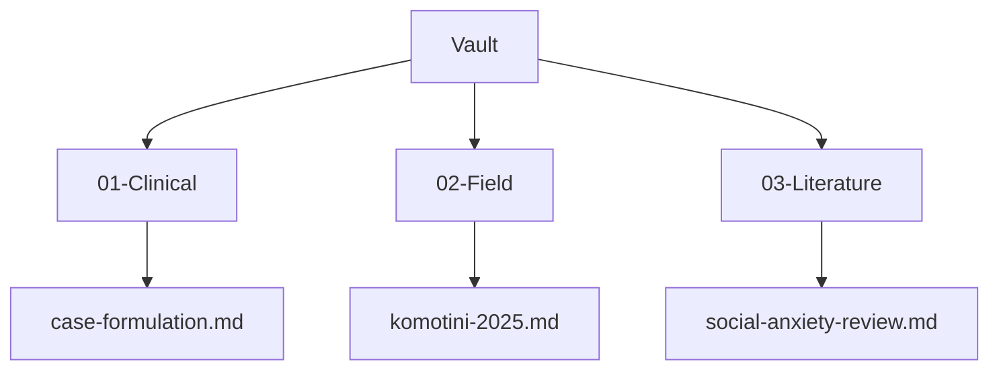
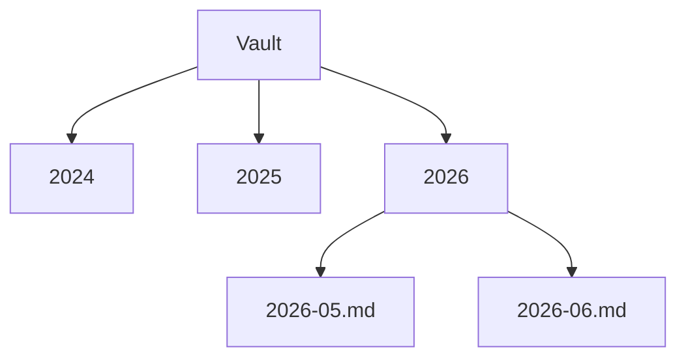
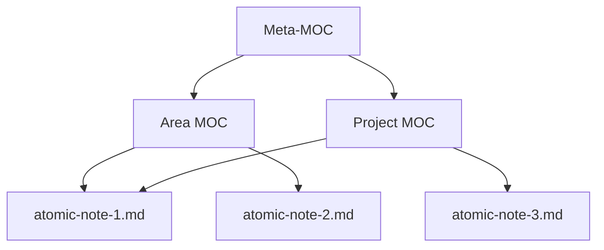

# Folder Discipline and the Maps of Content (MOC) Pattern

The previous booklet established the four steps of the Memory as Vault pattern. This booklet deepens the Store step among those four. Where information belongs looks like a simple question on the surface — but it is an engineering decision, and a consequential one. A wrong folder architecture imposes a hidden productivity tax on a researcher within months. A right architecture shifts finding a file from conceptual recollection to structural navigation. The aim here is to treat folder architecture not as a matter of personal taste but as a design decision, and to adapt the maps of content (MOC) pattern — a practitioner concept introduced by the personal knowledge management community, not an established academic construct — to the social science research context.

## 1. The Cost Calculation of Folder Choice

When a scholar sets up their vault, they most often choose the folder architecture without thinking. The first structure that comes to mind is built, files are dropped in, and work begins. This choice looks cheap. Its real cost emerges over time.

Six months later, the researcher searches for a file and has to remember where they left it. A year later, the same document sits in two different folders under two different names. Two years later, half the vault is inaccessible — not because anything was deleted, but because no one can reconstruct which information is where. Personal information management research has documented this dynamic directly: scattered storage and inconsistent naming create refinding costs that accumulate silently across a researcher's working life, ultimately constraining what knowledge they can actually act on (Jones, 2007).

This is a hidden tax, because it is not directly visible at the moment of filing. Every misplaced file generates a future search cost; the full overhead only becomes apparent when multiplied across hundreds of documents over years. The basic principle Norman (2013) set out on the design of everyday things applies here — the usability of a system is inversely proportional to how much the user has to think while navigating it. A well-designed vault does not require the researcher to think in order to find a file, because the structure itself shows the way. Folder discipline is not an aesthetic preference. It is an engineering investment that lowers the future cost of access, starting today.

## 2. A Comparison of Three Common Architectures

Three basic folder architectures are common in academic vaults. Each has a logic and a cost.

The first is the topical architecture. Folders are organized by research area: clinical notes in one folder, fieldwork in another, literature in a third.



The second is the chronological architecture. Folders are organized by time — one folder per year, one subfolder per month. This is natural for journaling, but it hides the topical context of any given piece of information.



The third is the project-based architecture. Folders are organized by active projects. This is efficient in the short term, but it conflicts with the long-lived nature of academic production: a project ends while the knowledge it produced remains. None of these three architectures is sufficient on its own. The topical architecture hides time, the chronological architecture hides topic, the project-based architecture hides permanence. The solution is not to choose one of them but to add a navigation layer on top — and that layer is the map of content.

## 3. PARA, Zettelkasten, and Johnny Decimal

Three popular organization patterns shed light on academic vault design, though none is sufficient as it stands.

The PARA pattern — Projects, Areas, Resources, Archive — is a system proposed by Tiago Forte (2022), a productivity practitioner and author. It organizes information by proximity to action and is powerful for personal productivity. For academic production it falls short in one specific way: in an academic vault, an article begins as a Project, then becomes a Resource, then ten years later becomes an Archive. PARA captures this life cycle, but across that cycle the file must be moved — and each move creates friction.

The Zettelkasten pattern is the atomic note system popularized by Sönke Ahrens (2017), drawing on the practice of the sociologist Niklas Luhmann. Each note carries a single thought; notes link to one another. The Zettelkasten is powerful for developing ideas, but on its own it is insufficient for managing large document collections where a researcher needs to navigate by project or deadline, not only by conceptual association.

The Johnny Decimal pattern organizes folders with a numbered decimal system: an area is 10–19, a subarea is 11, a document is 11.01. Navigation becomes numerical and precise. For an academic vault, the value of Johnny Decimal is an ordering and addressing system embedded directly in folder names.

For the social sciences, these three patterns are complementary rather than competing: PARA handles the life cycle, Zettelkasten handles the connection of ideas, Johnny Decimal handles navigation. The most robust academic vault combines all three — numbered folders, atomic notes, and the maps of content that link them together. The basic principle Allen (2015) set out in his productivity practitioner work also applies here: a system reduces mental load only when the researcher genuinely trusts it. That trust depends on the consistency of the structure.

## 4. MOC, the Maps of Content Pattern

The map of content — MOC — is the navigation spine of a vault. As used in this guide, MOC is a practitioner concept from the personal knowledge management community, not an established academic construct; the term is used here as a working operational definition. A map of content is a gateway opening onto a topic: it gathers related documents in a single place, provides brief context among them, and directs the reader to the right document. Crucially, a map of content is not a folder but a document. Folders group files physically; maps of content group files conceptually. A file sits in a single folder, but it can appear in multiple maps of content — and this is exactly what makes the pattern powerful.

Why a map of content is necessary follows directly from the limits of the three architectures in the previous section. Folder architecture is one-dimensional: a file is in one folder. But knowledge is multidimensional. A case note can belong simultaneously to the clinical area, to a particular project, and to a particular theoretical framework. The map of content captures that multidimensionality. Bates's (2002) integrated model of information seeking and searching is relevant here: researchers search for information not along a single linear path but from many interconnected entry points, and the map of content makes those entry points concrete and navigable.

How a map of content is built is straightforward. A topic is chosen; the documents related to that topic are listed; a short context sentence is added to each; the map is framed with an introductory paragraph. The goal is density and readability: minimal ornament, maximum signal, a structure that makes the vault's contents immediately legible to the researcher who built it — and, six months later, to a version of that same researcher who no longer remembers exactly where everything is.

## 5. The Atomic Note, MOC, Meta-MOC Hierarchy

Maps of content do not remain at a single level; they form a hierarchy. This hierarchy has three layers.



The lowest layer is the atomic note — a single thought, a single source, a single observation. Atomic notes are the building blocks of the vault. The middle layer is the map of content: it gathers related atomic notes under a topic. The top layer is the meta map of content, or meta-MOC: it gathers maps of content and serves as the vault's highest-level navigation gateway. When a researcher enters the vault, they open the meta-MOC first, move to the relevant area map, then descend to a particular atomic note.

The power of this hierarchy is that the same atomic note can appear in multiple maps of content. As the diagram shows, atomic-note-1 appears both in the Area MOC and in the Project MOC. This overcomes the one-dimensionality of folder architecture: the file lives physically in a single folder, but conceptually it inhabits multiple maps. The hierarchy transforms the vault from a pile of files into a navigable knowledge space — one that becomes more useful, not less, as the vault grows.

## 6. Markdown Conventions

The consistency of a vault rests on small but disciplined conventions. These ensure that the same rules govern every document in the vault.

| Element | Convention | Example |
|---|---|---|
| File name | English, lowercase, hyphen-separated | `clinical-case-formulation.md` |
| Title | Turkish, in the frontmatter `title` field | `title: "Vaka Formülasyonu"` |
| Internal link | Double square brackets | `[[komotini-field-2025]]` |
| Tag | frontmatter list | `tags: [clinical, formulation]` |
| Date | ISO 8601 format | `2026-05-24` |
| Heading level | A single first-level heading | `# Document Title` |

The most important of these conventions is the distinction between the file name and the title. The file name is kept English and plain; the Turkish title lives within the frontmatter. The reason is the Unicode issue addressed in section 9. Double square bracket links are the concrete application of the hypertext principle described in the previous booklet: when a document references another, that reference becomes a navigable link. Frontmatter tags let the machine query the vault — a researcher can gather all documents bearing a particular tag with a single command.

## 7. An Example Academic Vault, Three MOC Types

A concrete example clarifies the pattern. Consider the vault of a clinical psychologist with ten years of practice. This vault contains three types of maps of content.

The first is the project map of content, which manages an active research project.

```text
---
type: moc-project
tags: [moc, social-anxiety-study]
---
# Social Anxiety Study MOC

This map gathers all documents of the ongoing social anxiety research.

- [[social-anxiety-literature-review]] literature review summary
- [[komotini-field-2025]] field data notes
- [[analysis-plan-v2]] current analysis plan
```

The second is the area map of content, which tracks a field of expertise over the long term.

```text
---
type: moc-area
tags: [moc, clinical-formulation]
---
# Clinical Formulation Area MOC

All conceptual notes accumulated on case formulation.

- [[biopsychosocial-model]] theoretical framework
- [[formulation-template]] standard template
```

The third is the archive map of content, which preserves completed projects. When a project ends, the project map is linked to the archive map — but the documents are not deleted. These three types together enrich Forte's (2022) PARA life cycle with a map of content layer: a project begins in the project map, matures in the area map, and is preserved in the archive map. The document is never moved; only its visibility across maps changes. This eliminates the moving friction that PARA on its own creates.

## 8. Resilience to Tool Changes

The long life of a vault rests on its being tied to no single tool. A researcher may hold their vault today in a note application — but that application may shut down in five years, or change its pricing policy, or be acquired and discontinued. The vault must survive that change. The basis of resilience is the plain-text Markdown principle: maps of content, square-bracket links, and frontmatter are all plain-text conventions. They are tied not to any particular application but to the Markdown standard.

The practical test is simple: when the vault is taken out of a favorite application and opened in a plain-text editor, is it still navigable? In a well-designed vault the answer is yes — because the links are visible within the text, the maps are readable documents, and the tags are plain-text fields. When a tool changes, the only thing lost is the visual conveniences that tool provided, not the vault itself. This resilience makes the vault reliable at the scale of ten years, which is the appropriate planning horizon for a research career.

## 9. Turkey and Greece Specificity

Turkish and Greek file names harbor a technical trap. Turkish characters — in particular ğ, ü, ş, ı, ö, ç — can cause problems between operating systems when used in file names. The reason is that Unicode normalization works differently across systems: macOS stores characters in NFD form, while Linux expects NFC. When a vault is moved between these two systems through git, file names with Turkish characters can become corrupted or duplicated.

The solution is simple and is already embedded in the conventions above: file names are kept English and plain, while the Turkish title lives in the `title` field within the frontmatter. A document is stored under the name `social-anxiety-review.md`, but its frontmatter contains `title: "Sosyal Kaygı Derlemesi"`. This rule solves the technical problem and eases international collaboration simultaneously — English file names travel safely across language environments. The same rule holds for Greek: plain Latin-letter file names rather than αβγ characters. This is not a deep technical debate but a single discipline rule, with detailed troubleshooting left to the closing booklet.

## 10. Bridge, to Citation Discipline

After the folder architecture is established, the bibliographic integrity of every reference that enters it determines the long life of the vault. However well a vault is organized, if the citations within it are inconsistent or unverified, academic production built on top of them cannot be trusted. The next category addresses APA 7 and DOI discipline — showing how every reference is held in a correct, verified, and consistent form. Knuth's (1984) philosophy of literate programming frames the underlying principle: write your document so that a human can read it, and accept the machine's ability to read it as an additional feature, not the primary goal. As Brown and Duguid (2017) observed in their practitioner analysis of information systems, a vault is not merely a file store but an environment in which knowledge lives with its context — and the citation is part of that context.

## References

Citations are in APA 7 format. DOIs are verified against Crossref. Bates (2002) is cited without a DOI; no Crossref record is available for the *New Review of Information Behaviour Research* article. Trade books (Ahrens, Allen, Brown & Duguid, Forte, Norman) are cited with ISBN and framed throughout as practitioner sources.

Ahrens, S. (2017). *How to take smart notes: One simple technique to boost writing, learning and thinking*. ISBN 978-1542866507

Allen, D. (2015). *Getting things done: The art of stress-free productivity* (revised edition). Penguin Books. ISBN 978-0-14-312656-9

Bates, M. J. (2002). Toward an integrated model of information seeking and searching. *New Review of Information Behaviour Research*, 3(1), 1–15.

Brown, J. S., & Duguid, P. (2017). *The social life of information* (updated edition, with a new preface). Harvard Business Review Press. ISBN 978-1-63369-241-1

Forte, T. (2022). *Building a second brain: A proven method to organize your digital life and unlock your creative potential*. Atria Books. ISBN 978-1-9821-6738-9

Jones, W. (2007). Personal information management. *Annual Review of Information Science and Technology*, 41(1), 453–504. https://doi.org/10.1002/aris.2007.1440410117

Knuth, D. E. (1984). Literate programming. *The Computer Journal*, 27(2), 97–111. https://doi.org/10.1093/comjnl/27.2.97

Norman, D. A. (2013). *The design of everyday things* (revised and expanded edition). Basic Books. ISBN 978-0-465-05065-9

---

**Booklet ID.** `004-01-0001`
**Version.** `0.1.0`
**Date.** 2026-06-04
**Approximate word count.** 2595 (English body text, measured with wc)
**Verified citations.** 9
**Hallucinated citations.** 0
**Previous booklet.** [`003-01-0001`](../../003-memory-system/003-01-0001/en.md). Memory as Vault, A First-Principles Introduction
**Next booklet.** [`007-02-0001`](../../007-academic-writing/007-02-0001/en.md). APA 7 with DOI Discipline
