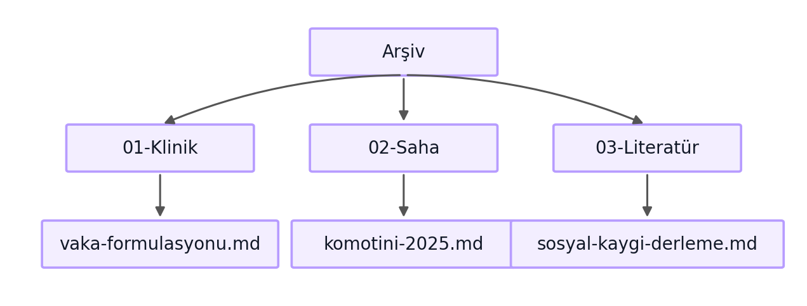
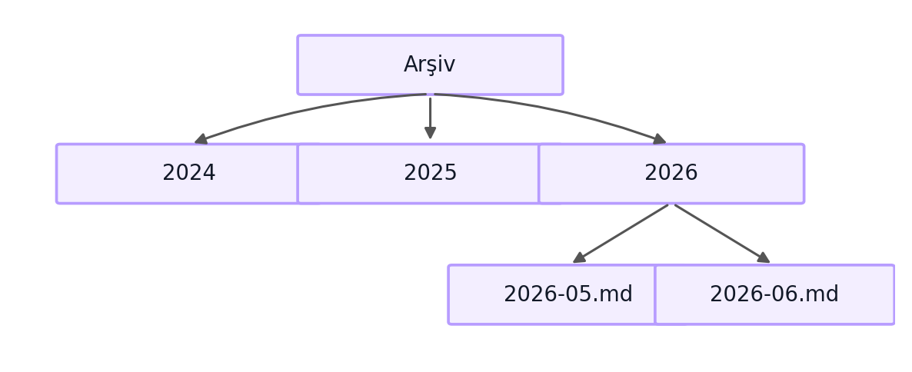
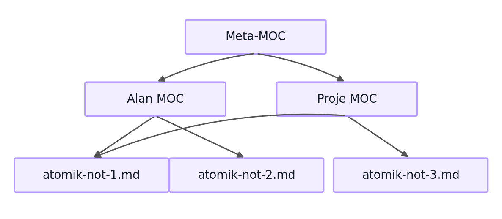

# Klasör Disiplini ve Maps of Content (MOC) Kalıbı

Önceki kitapçık, hafızayı arşive dönüştürme kalıbının dört adımını kurmuştu. Bu kitapçık o dört adımdan Saklama adımını derinleştirir. Bilginin nereye ait olduğu sorusu yüzeyde basit görünür. Özünde bir mühendislik kararıdır. Ve sonuçları ağırdır. Yanlış bir klasör mimarisi araştırmacıya aylar içinde gizli bir verimlilik vergisi yükler. Doğru bir mimari ise dosya bulmayı kavramsal hatırlamadan yapısal navigasyona taşır. Hedef, klasör mimarisini bir tasarım kararı olarak ele almak ve içerik haritası kalıbını, yani Maps of Content (MOC) kalıbını sosyal bilim araştırması bağlamına uyarlamaktır. MOC, kişisel bilgi yönetimi topluluğundan gelen bir uygulayıcı kavramıdır. Yerleşik bir akademik yapı olma iddiası taşımaz.

## 1. Klasör Seçiminin Maliyet Hesabı

Bir akademisyen arşivini kurarken klasör mimarisini çoğu zaman düşünmeden seçer. Aklına gelen ilk yapıyı kurar, dosyaları atar ve çalışmaya başlar. Bu seçim başlangıçta ucuz görünür. Gerçek maliyeti zamanla yüzeye çıkar.

Altı ay sonra araştırmacı bir dosyayı ararken onu nerede bıraktığını hatırlamak zorunda kalır. Bir yıl sonra aynı belge iki farklı klasörde iki farklı adla durur. İki yıl sonra arşivin yarısı erişilemez hale gelir. Silindiği için değil. Kaybolduğu için. Adres unutuldu, hangi klasörün hangi mantıkla kurulduğu artık kimseye net değil.

Bu, gizli bir vergidir. Doğrudan görünmediği için sinsice birikir. Kişisel bilgi yönetimi araştırmaları bu dinamiği doğrudan belgelemiştir: dağınık depolama ve tutarsız adlandırma, araştırmacının çalışma yaşamı boyunca sessizce birikim yapan yeniden bulma maliyetleri üretir. Bu maliyetler zamanla araştırmacının gerçekte üzerine eylem kurabileceği bilgiye erişimini kısıtlar (Jones, 2007). Yanlış yerleştirilen her dosya, gelecekte bir arama maliyeti doğurur. Tam yük, yüzlerce belge üzerinden yıllar içinde çarpılarak ancak fark edilir hale gelir.

Sabah masa başına oturan araştırmacı, o makalesi için geçen yılın notunu arar, bulamaz, yeniden okumaya başlar. Bu on dakika kaybolmadı. Ödendi. Norman'ın (2013) gündelik nesnelerin tasarımı üzerine ortaya koyduğu temel ilke burada doğrudan geçerlidir: bir sistemin kullanılabilirliği, kullanıcının onu kullanırken ne kadar düşünmek zorunda kaldığıyla ters orantılıdır. İyi tasarlanmış bir arşiv araştırmacının dosya bulmak için düşünmesini gerektirmez, çünkü yapı kendisi yolu gösterir. Klasör disiplini, gelecekteki erişim maliyetini bugünden düşüren bir mühendislik yatırımıdır.

## 2. Yaygın Mimari Seçeneklerinin Karşılaştırılması

Akademik arşivlerde öne çıkan her klasör mimarisinin kendine özgü bir mantığı ve farklı bir maliyet yapısı vardır.

Konu bazlı mimari, klasörleri araştırma alanlarına göre düzenler: klinik notlar bir klasörde, saha çalışması başka bir klasörde, literatür ayrı bir klasörde.



*Şekil 1. Alana göre klasör disiplini. Arşiv kökü altında Klinik, Saha ve Literatür dalları.*

Kronolojik mimari ise klasörleri zamana göre düzenler: her yıl bir klasör, her ay bir alt klasör. Günlük tutma için doğal bir yapıdır bu. Ama bir bilginin konu bağlamını gizler.



*Şekil 2. Zamana göre klasör disiplini. Yıl ve ay bazlı günlük kayıt.*

Proje bazlı mimari ise klasörleri aktif projelere göre düzenler. Kısa vadede verimlidir. Ama akademik üretimin uzun ömürlü yapısıyla çelişir: proje biter, ürettiği bilgi kalır.

Bu mimarilerin hiçbiri tek başına yeterli değildir. Konu bazlı mimari zamanı gizler, kronolojik mimari konuyu gizler. Proje bazlı mimari ise kalıcılığı feda eder. Çıkış yolu, hepsinin üstüne bir navigasyon katmanı eklemektir. O katman, içerik haritasıdır.

## 3. PARA, Zettelkasten ve Johnny Decimal

PARA, Zettelkasten ve Johnny Decimal, akademik arşiv tasarımına farklı açılardan yaklaşır. Sağladıkları fırsatlar birbirinden ayrıdır, sınırları da.

PARA, Projeler, Alanlar, Kaynaklar, Arşiv anlamına gelir. Tiago Forte'nin (2022) önerdiği bu sistem bilgiyi eyleme yakınlığına göre düzenler ve kişisel verimlilik için güçlüdür. Akademik üretim söz konusu olduğunda belirli bir sürtünme yaratır: akademik arşivdeki bir makale Proje olarak başlar, zamanla Kaynak olur, on yıl sonra Arşiv'e düşer. PARA bu yaşam döngüsünü kavrar. Ama döngü boyunca dosyanın taşınması gerekir ve her taşıma bir maliyet doğurur.

Zettelkasten, Sönke Ahrens'in (2017) popülerleştirdiği atomik not sistemidir. Sosyolog Niklas Luhmann'ın pratiğinden beslenen bu sistem, her notun tek bir düşünce taşıdığı ve notların birbirine bağlandığı bir ağ kurar. Fikir geliştirme için güçlüdür. Ne var ki araştırmacının proje ya da son tarihe göre değil yalnızca kavramsal çağrışımla gezinmesi gereken büyük belge koleksiyonlarını yönetmekte tek başına yetersiz kalır.

Johnny Decimal, klasörleri numaralı bir ondalık sistemle düzenler: bir alan 10-19, bir alt alan 11, bir belge 11.01. Navigasyonu sayısal ve kesin kılan bu kalıbın akademik arşiv için asıl değeri, klasör adlarına gömülü bir sıralama ve adres sistemi getirmesidir.

Bir proje klasörüne konan makale, proje bittiğinde nereye gider? Arşivi olan herkes bu soruyla bir gün karşılaşır. Proje kapanır. O makale hâlâ işe yarar, hâlâ başka bir çalışmada görünür. PARA'da taşımak gerekir. Zettelkasten'de not kendi bağlantılarıyla yaşıyor zaten. Johnny Decimal'de adres numarası değişmeden içerik güncellenir. Araştırmacı bu sürtünmeyi bir kez yaşadıktan sonra tek kalıbın yetmediğini içgüdüsel olarak kavrar.

Sosyal bilim için bu kalıplar rekabet eden değil tamamlayan seçeneklerdir. PARA yaşam döngüsünü kavrarken Zettelkasten kavramsal ağı güçlendirir, Johnny Decimal ise adresi sayısallaştırır. En sağlam akademik arşiv bu üçünü katmanlar: dosya adlarına gömülü numaralama adres sistemini sabitler. Atomik notlar tek bir düşünceyi kendi başına taşır. İçerik haritaları ise tüm bu yapıyı gezilebilir bir bütüne dönüştürür. Allen'ın (2015) verimlilik üzerine ortaya koyduğu ilke de bu noktayı destekler: bir sistem ancak araştırmacının güvendiği bir yapıya sahipse zihinsel yükü azaltır. O güven, yapının tutarlılığından gelir.

## 4. MOC, İçerik Haritası Kalıbı

İçerik haritası, yani MOC, akademik arşivin navigasyon omurgasıdır. Bu kılavuzda MOC, kişisel bilgi yönetimi topluluğundan gelen bir uygulayıcı kavramı olarak kullanılmaktadır. Buradaki anlamı işlevsel bir çalışma tanımıdır. Akademik bir terminoloji önerisi değildir. İçerik haritası bir konuya açılan kapıdır: ilgili belgeleri tek bir yerde toplar, aralarında kısa bir bağlam kurar ve okuru doğru belgeye yönlendirir. Kritik fark şuradadır: klasörler dosyaları fiziksel olarak gruplarken içerik haritaları onları kavramsal olarak gruplar. İçerik haritası okunabilir bir belgedir. Dosyaları içine almaz, onlara bağlantı kurar. Bu ayrımın pratik sonucu şudur: bir dosya tek bir klasörde durur ama birden çok içerik haritasında görünebilir. Bu kalıbı güçlü kılan da tam olarak budur.

İçerik haritasının niçin gerekli olduğu, ikinci bölümdeki üç mimarinin sınırından doğrudan gelir. Klasör mimarisi tek boyutludur. Bir dosya bir klasördedir. Oysa bilgi çok boyutludur. Bir vaka notu hem klinik alana hem belirli bir projeye hem de belirli bir kuramsal çerçeveye aynı anda ait olabilir. İçerik haritası bu çok boyutluluğu yakalar. Bates'in (2002) bilgi arama ve tarama davranışına ilişkin bütünleşik modeli de bu noktayı destekler: araştırmacılar bilgiyi birbirine bağlı pek çok giriş noktasından arar. İçerik haritası, bu giriş noktalarını somutlaştırır ve gezilebilir kılar.

İçerik haritası kurmak teknik olarak basittir. Bir konu seçilir, o konuyla ilgili belgeler listelenir, her belgeye kısa bir bağlam cümlesi yazılır. Haritanın girişine bir çerçeveleme paragrafı eklenir. Hedef, gereksiz süslemeden arınmış, bilgi yoğunluğu yüksek ve araştırmacının arşivini hem yapım anında hem de altı ay sonra kolayca okuyabileceği bir yapıdır. Arşivin görünür iskeleti.

## 5. Atomik Not, MOC, Meta-MOC Hiyerarşisi

İçerik haritaları tek bir düzeyde kalmaz. Birbirini besleyen katmanlardan oluşan bir hiyerarşi kurarlar.



*Şekil 3. MOC hiyerarşisi. Meta-MOC, Alan ve Proje MOC'larını; onlar da atomik notları bağlar.*

En alt katman atomik nottur: tek bir düşünce, tek bir kaynak ya da tek bir gözlem. Arşivin yapı taşlarıdır bunlar. Orta katman içerik haritasıdır: ilgili atomik notları bir konu altında toplar. En üst katman meta içerik haritasıdır, yani meta-MOC. İçerik haritalarını bir araya getiren ve arşivin en üst düzey navigasyon kapısı olan bu katmana araştırmacı arşive girince önce bakar, oradan ilgili alan haritasına, oradan da belirli bir atomik nota iner.

Bu hiyerarşinin gücü, aynı atomik notun birden çok içerik haritasında görünebilmesinden gelir. Diyagramda da görüldüğü gibi, atomik-not-1 hem Alan MOC'ta hem Proje MOC'ta yer alır. Klasör mimarisinin tek boyutluluğunu hiyerarşi bu şekilde aşar: dosya fiziksel olarak tek bir klasörde durur, ama kavramsal olarak birden çok haritada yaşar. Bir not, iki yerde. Taşınmadan. Hiyerarşi arşivi bir dosya yığınından gezilebilir bir bilgi alanına dönüştürür. Arşiv büyüdükçe bu alan daha az değil, daha çok işe yarar.

## 6. Markdown Sözleşmeleri

Arşivin tutarlılığı, küçük ama disiplinli sözleşmelere dayanır. Bu sözleşmeler arşivdeki her belgede aynı kuralların uygulanmasını sağlar.

| Öğe | Sözleşme | Örnek |
|---|---|---|
| Dosya adı | İngilizce, küçük harf, tire ile ayrık | klinik-vaka-formulasyonu.md |
| Başlık | Türkçe, frontmatter title alanında | title: "Vaka Formülasyonu" |
| Dahili bağlantı | Köşeli çift parantez | [[komotini-saha-2025]] |
| Etiket | frontmatter listesi | etiketler: [klinik, formulasyon] |
| Tarih | ISO 8601 biçimi | 2026-05-24 |
| Başlık düzeyi | Tek bir birinci düzey başlık | # Belge Başlığı |

Bu sözleşmeler arasında en kritik olanı, dosya adı ile başlık arasındaki ayrımdır. Dosya adı İngilizce ve sade tutulur, Türkçe başlık frontmatter içinde yaşar. Bu ayrımın nedeni, dokuzuncu bölümde ele alınan Unicode meselesidir. Köşeli çift parantez bağlantıları, önceki kitapçıkta tanımlanan hipertekst ilkesinin somut uygulamasıdır: bir belge başka bir belgeye atıf verdiğinde bu atıf gezilebilir bir bağlantıya dönüşür. Frontmatter etiketleri ise makineye arşivi sorgulatmanın kapısını açar. Araştırmacı belirli bir etikete sahip tüm belgeleri tek bir komutla toplayabilir.

## 7. Örnek Akademik Arşiv: MOC Tipleri

Somut bir örnek kalıbı netleştirir. On yıllık pratiği olan bir klinik psikoloğun arşivini ele alalım. Bu arşivde işleve göre ayrışan farklı içerik haritaları bulunur.

İlki proje içerik haritasıdır. Aktif bir araştırma projesini yönetir.

```text
---
tip: moc-proje
etiketler: [moc, sosyal-kaygi-calismasi]
---
# Sosyal Kaygı Çalışması MOC

Bu harita, devam eden sosyal kaygı araştırmasının tüm belgelerini toplar.

- [[sosyal-kaygi-literatur-derleme]] literatür taraması özeti
- [[komotini-saha-2025]] saha verisi notları
- [[analiz-plani-v2]] güncel analiz planı
```

İkincisi alan içerik haritasıdır. Bir uzmanlık alanını uzun vadede izler.

```text
---
tip: moc-alan
etiketler: [moc, klinik-formulasyon]
---
# Klinik Formülasyon Alanı MOC

Vaka formülasyonu üzerine biriken tüm kavramsal notlar.

- [[biyo-psiko-sosyal-model]] kuramsal çerçeve
- [[formulasyon-sablonu]] standart şablon
```

Son tür arşiv içerik haritasıdır. Tamamlanmış projeleri korur: bir proje bittiğinde proje haritası arşiv haritasına bağlanır, ancak belgeler silinmez. Bu tipler birlikte Forte'nin (2022) PARA yaşam döngüsünü içerik haritası katmanıyla zenginleştirir. Proje haritasında açılan bir çalışma alan haritasında kavramsal derinlik kazanır. Proje kapandığında belge yerinde kalır ve arşiv haritasına yalnızca bağlanır. Taşıma yoktur. Haritalardaki görünürlük değişir, dosyanın adresi değişmez. PARA'nın tek başına yarattığı sürtünme bu şekilde ortadan kalkar.

## 8. Araç Değişikliklerine Dayanım

Akademik bir arşivin uzun ömrü, hiçbir tek araca bağlı olmamasına dayanır. Araştırmacı bugün arşivini bir not uygulamasında tutabilir. Ama o uygulama beş yıl sonra kapanabilir, fiyatlandırma politikasını değiştirebilir ya da satın alınıp kapatılabilir. On yılda bir bu olur. Arşivin bu değişime dayanabilmesi gerekir. Dayanımın temeli, düz metin Markdown ilkesidir: içerik haritaları, köşeli parantez bağlantıları ve frontmatter, hepsi düz metin sözleşmeleridir. Belirli bir uygulamaya değil, Markdown standardına bağlıdırlar.

Pratik test şudur: arşiv, en sevilen uygulamadan çıkarılıp sade bir metin editöründe açıldığında hâlâ gezilebilir mi? İyi tasarlanmış bir arşivde yanıt evettir. Köşeli parantez bağlantıları metin içinde zaten görünürdür. Bir harita belgesi herhangi bir editörde düz yazı olarak okunur. Etiket ise frontmatter içinde sıradan bir karakter dizisinden ibarettir. Bir araç değiştiğinde kaybolan tek şey o aracın sunduğu görsel kolaylıklardır. Arşivin kendisi değil. Bu dayanım arşivi on yıl ölçeğinde güvenilir kılar. On yıl, araştırma kariyeri için uygun planlama ufkudur.

## 9. Türkiye ve Yunanistan Özgüllüğü

Türkçe ve Yunanca dosya adları teknik bir tuzak barındırır. Türkçe karakterler, özellikle ğ, ü, ş, ı, ö, ç, dosya adlarında kullanıldığında işletim sistemleri arasında sorun çıkarabilir. Bunun nedeni, Unicode normalizasyonunun farklı sistemlerde farklı çalışmasıdır: macOS dosya sistemi karakterleri NFD biçiminde saklarken Linux NFC biçimini bekler. Arşiv git üzerinden bu iki sistem arasında taşındığında Türkçe karakterli dosya adları bozulabilir ya da çoğaltılabilir. Sessizce. Fark edilmeden.

Çözüm basittir ve altıncı bölümdeki sözleşmelerde zaten kurulmuştur: dosya adları İngilizce ve sade tutulur, Türkçe başlık frontmatter içindeki `title` alanında yaşar. Bir belge `sosyal-kaygi-derleme.md` adıyla saklanır. Ama frontmatter'ında `title: "Sosyal Kaygı Derlemesi"` bulunur. Bu kural hem teknik sorunu çözer hem de uluslararası iş birliğini kolaylaştırır. İngilizce dosya adları farklı dil ortamlarında güvenle taşınır. Aynı kural Yunanca için de geçerlidir: αβγ karakterleri yerine Latin harfli sade dosya adları kullanılır. Derin teknik bir tartışma değil, tek bir disiplin kuralıdır bu. Ayrıntılı sorun giderme kapanış kitapçığına bırakılmıştır.

## 10. Köprü, Atıf Disiplinine

Klasör mimarisi kurulduktan sonra, içine giren her referansın bibliyografik bütünlüğü arşivin uzun ömrünü belirler. Arşiv ne kadar iyi düzenlenirse düzenlensin, içindeki atıflar tutarsız ya da doğrulanmamışsa bu yapı üzerinde kurulan akademik üretim güvenilir olmaz. Bir sonraki kategori, APA 7 ve DOI disiplinini ele alır: her referansın doğru, doğrulanmış ve tutarlı biçimde nasıl tutulacağını gösterir.

Knuth (1984), edebi programlama felsefesinde şunu ortaya koyar: bir belgeyi önce insan okuyabilsin diye yaz, makinenin onu işlemesi ikincil gelir. Aynı ilke arşive uygulanır: bir referans önce araştırmacının çalışmasında yer bulabilsin diye doğrulanır, bibliyografik biçim bunun üstüne kurulur. Brown ve Duguid (2017) ise bilginin sosyal yaşamını incelerken şunu gösterir: bir akademik arşiv yalnızca dosya deposu değildir, içinde bilginin bağlamıyla birlikte yaşadığı bir ortamdır. Bağlam canlı kalırsa arşiv canlı kalır. Atıf, bu yapının omurgasıdır. Kırılırsa yapı yıkılır.

## Kaynakça

Atıflar APA 7 biçimindedir. DOI'ler Crossref üzerinden doğrulanmıştır (2026-06-21). Bates (2002), DOI olmaksızın belirtilmiştir. *New Review of Information Behaviour Research* makalesine ait bir Crossref kaydı mevcut değildir. Ticari kitaplar (Ahrens, Allen, Brown ve Duguid, Forte, Norman) ISBN ile belirtilmiş ve metin boyunca uygulayıcı kaynaklar olarak çerçevelenmiştir.

Ahrens, S. (2017). *How to take smart notes: One simple technique to boost writing, learning and thinking*. ISBN 978-1542866507

Allen, D. (2015). *Getting things done: The art of stress-free productivity* (gözden geçirilmiş baskı). Penguin Books. ISBN 978-0-14-312656-9

Bates, M. J. (2002). Toward an integrated model of information seeking and searching. *New Review of Information Behaviour Research*, 3(1), 1–15.

Brown, J. S., & Duguid, P. (2017). *The social life of information* (güncellenmiş baskı, yeni önsözle). Harvard Business Review Press. ISBN 978-1-63369-241-1

Forte, T. (2022). *Building a second brain: A proven method to organize your digital life and unlock your creative potential*. Atria Books. ISBN 978-1-9821-6738-7

Jones, W. (2007). Personal information management. *Annual Review of Information Science and Technology*, 41(1), 453–504. https://doi.org/10.1002/aris.2007.1440410117

Knuth, D. E. (1984). Literate programming. *The Computer Journal*, 27(2), 97–111. https://doi.org/10.1093/comjnl/27.2.97

Norman, D. A. (2013). *The design of everyday things* (gözden geçirilmiş ve genişletilmiş baskı). Basic Books. ISBN 978-0-465-05065-9

---

**Kitapçık kimliği.** `004-01-0001`
**Sürüm.** `0.2.0`
**Tarih.** 2026-06-21
**Lisans.** Bu kitapçık CC BY-NC-SA 4.0 ile lisanslanmıştır. https://creativecommons.org/licenses/by-nc-sa/4.0/
**Sözcük sayısı (yaklaşık).** 2027 (Türkçe gövde metni, wc ile ölçüldü)
**Doğrulanmış atıf sayısı.** 8
**Uydurma atıf sayısı.** 0
**Önceki kitapçık.** [`003-01-0001`](../../003-memory-system/003-01-0001/tr.md). Hafızayı Arşive Dönüştürmek. İlkesel Bir Giriş
**Sonraki kitapçık.** [`007-02-0001`](../../007-academic-writing/007-02-0001/tr.md). DOI Disiplini ile APA 7
